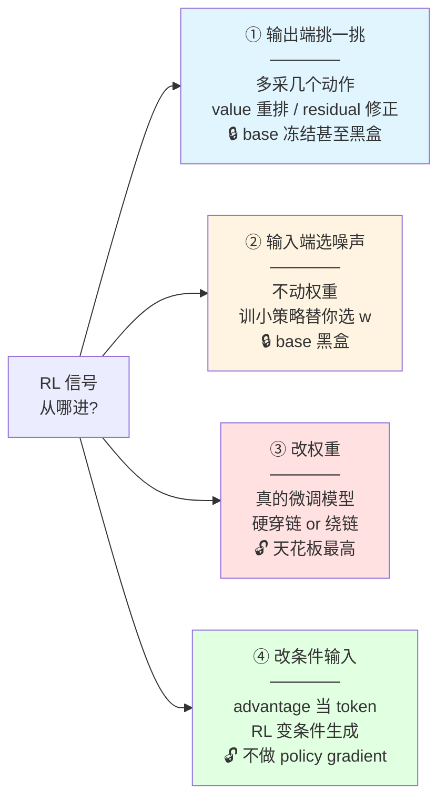

---
tags:
  - RL
  - post-training
  - diffusion-policy
created: 2026-06-10
---

# 🗺️ Diffusion/Flow 策略的 RL 改进路线图

> [!info] 这是什么
> 一张**提纲挈领的框架笔记**：预训练好的 diffusion/flow 策略部署后表现不够好，想用 RL 改进——所有方法按「RL 信号从哪个口子进入策略」分成四条路线。
> 由 2026-06-10 围绕 [[DSRL]] 的一轮检索整理而成。
> 关联：[[强化学习后训练 主题地图]]（领域地形图，本笔记是其 §4 对照轴的细化）｜[[Advantage-conditioned 微调]]（路线④）｜[[推理动力学 多维对比]] §5(b)（flow/diffusion 无闭式 log-prob 的展开）｜[[paper-list]]

---

## 0. 一个核心难点

> **diffusion/flow 策略的动作是多步去噪生成的 → 没有闭式 log-prob，对去噪链反传又贵又不稳。**

所以"用 RL 改进它"的所有方法，本质上只是在选：**RL 信号从哪个口子进入策略？**

---

## 1. 四个口子（按侵入程度从浅到深）

| | ① 输出端 | ② 输入端（噪声） | ③ 改权重 | ④ 改条件 |
| :--- | :--- | :--- | :--- | :--- |
| **怎么做** | 部署期重排 / 外挂 residual 小策略修正动作 | 训一个 latent-noise policy 替代 `w~N(0,I)` | 微调去噪网络本身 | advantage 离散化后当条件 token 喂入 |
| **动 base 吗** | 不动（冻结/黑盒） | 不动（黑盒，API 级访问即可） | 动 | 动（但目标仍是监督式回归） |
| **怎么绕开 log-prob 难点** | 根本不碰生成过程 | 把问题搬到噪声空间的标准 MDP | 硬穿（两层 MDP）或绕开（Q 引导/蒸馏） | 不需要 log-prob（条件生成） |
| **优点** | 即插即用、模型无关 | 样本效率极高、天然保守 | 天花板最高 | 稳、零推理开销 |
| **局限** | 工程补丁，天花板最低 | 表达力无理论保证、依赖 base 可 steer | 不稳/贵，全在跟去噪链搏斗 | 依赖 value 模型质量 |
| **代表** | V-GPS · ResiP | **DSRL** | **DPPO**（穿）· **QAM**（绕） | **RECAP / RISE** |

---

## 2. 只需记住 4 个代表

> 每个口子读一篇就能撑起整个格局，其余都是变体。

| 口子 | 代表作 | 状态 | 备注 |
| :--- | :--- | :--- | :--- |
| ② 选噪声 | **DSRL**（[2506.15799](https://arxiv.org/abs/2506.15799)，CoRL 2025） | 📖 在读 | π₀ 首次真机 RL 微调成功 |
| ③ 硬穿链 | **DPPO**（[2409.00588](https://arxiv.org/abs/2409.00588)，ICLR 2025） | ⬜ 候选 | RISE 和 DSRL 两边都拿它当 baseline 打的那个"PPO" |
| ③ 绕链 | **QAM**（[2601.14234](https://arxiv.org/abs/2601.14234)） | 📥 P0 队列 | FQL 是它的前置 |
| ④ 改条件 | **RISE**（[[RISE  Self-Improving Robot Policy with Compositional World Model\|笔记]]） | ✅ 已读 | advantage-conditioned，见 [[Advantage-conditioned 微调]] |

---

## 3. 各路线完整文章池（检索存档，需要时再翻）

> [!tip] 用法
> 这一节是 2026-06-10 那轮检索的存档——**平时别看**，等读完 §2 四个代表、需要找某条路线的变体时再回来翻。想排期读的移进 [[paper-list]]。

### 路线 ①：输出端（测试时引导 / residual 外挂）

**①a 测试时重排 / 价值引导（纯部署期，不训练）**

| 文章 | 一句话 | arXiv |
| :--- | :--- | :--- |
| **V-GPS** | offline RL 学 value，部署时对 generalist 采样动作重排序；**和 DSRL 同作者（Nakamoto），是 DSRL 的前传** | [2410.13816](https://arxiv.org/abs/2410.13816) |
| **VLS** | 用 VLM 做 steering，V-GPS 的 VLM 版 | [2602.03973](https://arxiv.org/abs/2602.03973) |
| （同类） | RoboMonkey / RoVer / MG-Select，见 [[LLM 启发地图]] §3.6 test-time scaling | — |

**①b residual 小策略外挂（冻结 base + RL 训修正项）**

| 文章 | 一句话 | arXiv |
| :--- | :--- | :--- |
| **Policy Decorator** | 模型无关 residual 在线精炼 + 受控探索；这条线代表作 | [2412.13630](https://arxiv.org/abs/2412.13630) |
| **ResiP** | 冻结 BC diffusion + PG 训 residual，精密装配；DSRL 的 baseline 之一 | [2407.16677](https://arxiv.org/abs/2407.16677) |
| **Residual Off-Policy RL** | residual 线的 off-policy 版，样本效率更高 | [2509.19301](https://arxiv.org/abs/2509.19301) |
| **EXPO** | 介于①③之间：base 用 IL 持续微调 + 轻量高斯 edit policy 往高 Q 改；绕开对去噪链反传（Levine 组） | [2507.07986](https://arxiv.org/abs/2507.07986) |
| （库里已有） | **PLD**（residual actor 探失败区→蒸馏回 generalist），见 [[强化学习后训练 主题地图]] §3.1 | [2511.00091](https://arxiv.org/abs/2511.00091) |

### 路线 ②：输入端（噪声空间）

| 文章 | 一句话 | arXiv |
| :--- | :--- | :--- |
| **DSRL** | latent-action MDP 形式化 + noise aliasing 双 critic；目前这条线唯一正主——**2026 还没有直接跟进，这个空格本身值得注意** | [2506.15799](https://arxiv.org/abs/2506.15799) |

### 路线 ③：改权重

**③a 硬穿链（policy gradient 穿去噪过程，on-policy）**

| 文章 | 一句话 | arXiv |
| :--- | :--- | :--- |
| **DPPO** | 奠基作：去噪过程 = 内层 MDP、环境 = 外层 MDP，两层 MDP 上跑 PPO | [2409.00588](https://arxiv.org/abs/2409.00588) |
| **SAC Flow** | **off-policy 版穿链**：发现 flow 的 Euler 积分 **≡ residual RNN**，梯度病同 RNN → 重参数化速度网 **Flow-G**（门控）/ **Flow-T**（解码）+ noise-augmented rollout，SAC 端到端、省样本；ICLR 2026 投稿。📥 P0 队列 | [2509.25756](https://arxiv.org/abs/2509.25756) |
| **ReinFlow** | flow 版：往确定性 flow 路径注入可学习噪声 → 似然可精确算，1 步去噪也能 RL（NeurIPS 2025） | [2505.22094](https://arxiv.org/abs/2505.22094) |
| **FPO（flow VLA）** | 用 per-sample flow-matching loss 变化量重构 importance sampling | [2510.09976](https://arxiv.org/abs/2510.09976) |
| （库里已有） | **π_RL**（Flow-Noise / Flow-SDE），见 [[强化学习后训练 主题地图]] §3.1 | [2510.25889](https://arxiv.org/abs/2510.25889) |
| 2026 新跟进 | **π-StepNFT**（步长问题）· **SA-VLA**（空间感知探索噪声）· **IG-RFT**（交互引导长程） | [2603.02083](https://arxiv.org/abs/2603.02083) · [2602.00743](https://arxiv.org/abs/2602.00743) · [2602.20715](https://arxiv.org/abs/2602.20715) |

**③b 绕链（critic/Q 驱动，actor-critic 簇——QAM 的谱系）**

| 文章 | 一句话 | arXiv |
| :--- | :--- | :--- |
| **DQL** | Q 梯度直接反传穿整条去噪链——最暴力也最不稳，**QAM 要治的就是它** | _待核实_ |
| **IDQL** | 反过来：actor 拟合所有采样动作，推理时用 critic 挑（训练不碰链） | _待核实_ |
| **QSM** | 把策略 score 对齐到 ∇ₐQ——**QAM 的直接前身**，读 QAM 前扫一眼 | [2312.11752](https://arxiv.org/abs/2312.11752) |
| **DIPO** | 用 ∇ₐQ 改动作本身（action gradient），actor 再拟合改过的动作 | _待核实_ |
| **FQL** | flow 只做 BC，另训 one-step 策略最大化 Q + 从 flow 蒸馏（**Park/Li/Levine，和 Q-chunking 同组**） | [2502.02538](https://arxiv.org/abs/2502.02538) |
| FQL 后续 | **One-Step FQL** · **Guided Flow Policy** · **Q-Flow** | [2508.13904](https://arxiv.org/abs/2508.13904) · [2512.03973](https://arxiv.org/abs/2512.03973) · [2605.13435](https://arxiv.org/abs/2605.13435) |
| （库里已有） | **QAM**（adjoint matching 逐步监督，📥 P1），见 [[强化学习后训练 主题地图]] §3.3。**2026-07-13 线上精读框架结论**：`L_AM` 把边界条件 `g̃(X,1)=−∇Q` 的 adjoint 状态（backward ODE，只用 behavior 模型 f_β 算、不反传被优化网络）写进速度回归目标；目标分布 **`π_θ ∝ π_β·e^{τQ}` ≡ advantage-conditioned 后验**——④和③b 指向同一分布，只是机制不同；chunk h=5、QAM-FQL/EDIT 保多模态；OGBench state-based | [2601.14234](https://arxiv.org/abs/2601.14234) |
| **Q-VGM** | Q-Guided Value-Gradient Matching for **flow VLA**——「QAM 式价值梯度匹配 × 视觉 VLA」这个格子 2026-06 已被占。**正是我 2026-07 放弃『QAM 内化搬上视觉』主线的印证**——转向「质量 × advantage 标签」是对的 | [2606.08015](https://arxiv.org/abs/2606.08015) |

### 路线 ④：改条件输入（advantage-conditioned）

| 文章 | 一句话 | arXiv |
| :--- | :--- | :--- |
| （库里已有） | **RECAP / π*₀.₆** 首提 · **RISE** 升级到 WM 内循环——完整谱系见 [[Advantage-conditioned 微调]] | [2511.14759](https://arxiv.org/abs/2511.14759) |

### 附：offline-to-online 专项（与 [[强化学习后训练 主题地图]] §3.2 衔接）

| 文章 | 一句话 | arXiv |
| :--- | :--- | :--- |
| **Flow Matching with Injected Noise for O2O RL** | 注噪 flow 做 offline-to-online | [2602.18117](https://arxiv.org/abs/2602.18117) |
| **Posterior BC** | 预训练阶段就为后续 RL 微调做准备的 BC 变体 | [2512.16911](https://arxiv.org/abs/2512.16911) |
| **SIME** | modal 级探索做自改进，可与 RISE 的 self-improving 框架对照 | [2505.01396](https://arxiv.org/abs/2505.01396) |

---

## 4. 横切观察

**谱系收敛于一个组。** Nakamoto（V-GPS→DSRL）、Seohong Park / Qiyang Li（FQL→Q-chunking→QAM）全在 Levine 组——这个问题的主线基本是一个组在推，三条技术路线（测试时引导→噪声空间→改训练目标）是他们内部的迭代。读 paper 时留意作者迁移，比读单篇更能看清"上一招的什么缺陷催生了下一招"。

**①②与③④的根本分界**：前者把 base 当黑盒（信号在生成过程**外面**），后者改变生成过程本身（信号在**里面**）。[[推理动力学 多维对比]] §4 的"改推理 vs 改训练（②/③真内化之分）"是同构的判据——DSRL 是那边的"①纯改推理"档，[[Legato 速度场推导]] 的反解范式则对应这边"把 Q 引导写进 v_target"的③b 终极形态。

**矛盾的实验证据（待解）**：RISE 笔记里 π₀.₅+DSRL = 10%（被 advantage-conditioned 85% 碾压），但 DSRL 原文里 π₀ 被 steer 到接近 100%。两边实验条件差异（base 可 steer 性、在线样本量、任务）是个值得搞清楚的问题——读 DSRL 时带着这个问题。

---

## 5. 跟我的关系

- 这张图是 [[强化学习后训练 主题地图]] §4 那根「信号来源 × 侵入程度」对照轴在「diffusion/flow 策略怎么被 RL 改」这个切面上的展开。
- 我的研究想法「把 chunk 级 advantage 写进 flow 的 v_target」（见 [[Legato 速度场推导]] §7）在这张图上的位置：**用④的思想做③b 的事**——比 QAM 的逐步监督更进一步，把价值引导内化成训练目标本身。
- 读序建议：DSRL（在读）→ DPPO → FQL → QAM（P0）。读完这四篇，§3 的文章池基本都能秒懂定位。

---

## 6. 待补 / 存疑

- [ ] DQL / IDQL / DIPO 的 arXiv 号未核实（检索摘要确认了机制，引用前自己查）
- [ ] 路线②只有 DSRL 一篇——定期回头搜一次"noise-space RL"有没有新跟进
- [ ] RISE vs DSRL 的矛盾实验证据（§4 第三条）——读 DSRL 附录 C 的实验设置后回来填
- [ ] 读完 DPPO 后决定：要不要把它从"候选"提进 [[paper-list]] P0

---

## Backlinks
（Obsidian 自动维护）
