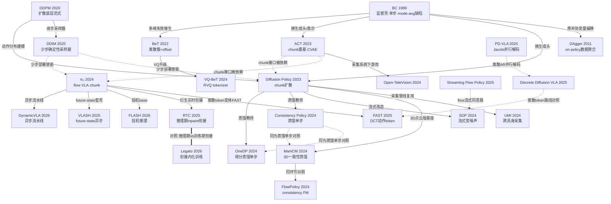

---
tags:
  - inference-dynamics
created: 2026-05-31
---

# 🔬 推理动力学 · 多维对比

> [!info] 用法说明
> 和导航用的「[[推理动力学 主题地图]]」互补——地图管脉络、这篇管"逐维拆开比异同"，把同一维度（动作表示 / 加速路线 / 改训练vs改推理 / RL接口）的所有文章横着摆在一起决策。关联标签 #inference-dynamics

## 0. 一句话框架

所有文章都在回答"观测→可执行动作"链路的某一环，链路可拆成四个环节：

1. **数据/IL 基础**（怎么拿到「观测→动作」的监督）：BC、DAgger、UMI、Open-TeleVision——决定监督信号从哪来、能否跨具身。
2. **动作表示**（动作怎么编码）：ACT、BeT、VQ-BeT、FAST——单步 vs chunk、连续 vs 离散 token。
3. **动作生成**（用什么模型分布拟合动作）：DDPM、DDIM、Diffusion Policy、π₀、SDP、Streaming Flow Policy、Discrete Diffusion VLA——回归 / 扩散 / flow / 离散扩散。
4. **实时推理**（如何在延迟约束下边推边执行）：Consistency Policy、OneDP、ManiCM、FlowPolicy、RTC、Legato、VLASH、DynamicVLA、FLASH、PD-VLA——减步 / 调度 / 内化衔接。

主线张力贯穿全篇：**改训练 vs 改推理**、以及**多步生成质量 vs 单次推理延迟**。

## 1. 主对比表：动作生成 + 实时推理

| 文章 | 动作表示 | 生成范式 | 推理步数 | 加速手段 | 改训练/改推理 | 延迟·衔接处理 | 多模态处理 | 代码状态 | 与RL接口 | 经典/前沿·年份 |
|---|---|---|---|---|---|---|---|---|---|---|
| **Diffusion Policy** | chunk·连续 | 扩散 DDPM(ε-MSE) | 多步(训练100/DDIM~10) | DDIM减步 | 改训练(回归→去噪) | receding-horizon重规划;无异步 | 高斯噪声起步天然多峰 | 已clone·源码确认 | 原生chunk;改loss易/可微采样重 | 经典·2023 |
| **DDPM** | N/A(图像;下游借用) | 扩散马尔可夫链 | 多步(T=1000) | 无 | 改训练(L_simple ε-MSE) | —(纯生成) | 迭代去噪不做模态平均 | 未clone(经典) | 是flow/扩散策略前身;Q反传需穿整链 | 经典·2020 |
| **DDIM** | N/A(采样器;对chunk通用) | 扩散(非马尔可夫确定性) | 少步(20-100) | 减步(跳步子序列) | **改推理**(仅换采样式) | —(使能少步部署) | η插值调随机;不破坏多峰 | 未clone(经典) | 即插减步加速rollout;改flow目标则不适用 | 经典·2020 |
| **π₀** | chunk(H≈50)·连续 | 条件流匹配(rectified-flow) | 多步(欧拉~10) | 本体无;衍生FAST/RTC | 改训练(AR→flow向量场) | 整段chunk开环;衔接靠衍生RTC | flow天然多峰+时间一致 | 已clone·结构+论文级 | 原生chunk;flow无闭式log-prob,PPO/SAC需近似 | 前沿·2024 |
| **SDP (Streaming DP)** | chunk(滚动buffer)·连续 | 扩散DDPM·变噪声(TEDi) | N步分摊到h个chunk(N/h次/周期) | **衔接inpainting/streaming**(FIFO buffer复用后段) | 两者(per-position噪声训练+流式推理) | FIFO buffer跨周期滚动复用,只补噪新段 | 完整DDPM保留多峰 | 已clone·源码确认 | chunk执行;但buffer跨周期延续,RL每步重采会丧失加速 | 前沿·2024 |
| **Streaming Flow Policy** | 连续轨迹(非离散chunk) | 流匹配CFM·flow-time≡traj-time | 单sweep积分(默认1000步Euler,边积分边发) | **衔接streaming**(积分=执行) | 两者(重定义速度场+边出边发) | 每积分步emit一个动作;无chunk缝合 | softmax高斯后验加权混合多示范 | 已clone·源码确认(解析示例,无NN训练) | 不输出chunk,与chunk级Q有粒度张力;需把积分区间当等效chunk | 前沿·2025 |
| **Discrete Diffusion VLA** | chunk(8步)·离散token(256bin) | 离散(mask)扩散·MaskGIT式 | 少步并行(12步unmask vs AR 56) | **并行解码**(confidence-based+remask) | 两者(masked CE训练+迭代unmask) | open-loop chunk+到点重规划;无异步缝合 | 类别分布+gumbel采样;easy-first保结构 | 已clone(libero简化版)·部分占位 | chunk契合;离散token有显式logπ易做优势加权CE;但unmask采样序列级logπ非平凡 | 前沿·2025 |
| **Consistency Policy** | chunk·连续 | EDM教师+CTM一致性蒸馏学生 | **单步**(可chaining3步) | **蒸馏**(consistency distillation) | 两者(改CTM训练目标→单步推理) | 无异步;靠单步降延迟+receding-horizon;chaining调精度 | 教师承载;可选KDE取众数选模 | 已clone·源码确认 | chunk兼容;单步折叠去噪轨迹,与QAM逐步监督叠加难;宜先RL教师再蒸馏 | 前沿·2024 |
| **OneDP** | chunk·连续 | 扩散教师+DMD/VSD得分蒸馏单步生成器 | **单步**(1.5→62Hz) | **蒸馏**(分布匹配/得分差) | 改训练(reverse-KL蒸馏)→改推理 | 单步消除迭代延迟;衔接沿用DP receding | OneDP-S随机保多峰/OneDP-D确定取众数 | 已clone·**未读出(仅论文级)** | chunk契合;单步无多步链可插Q引导,宜RL后蒸馏或对单步随机策略做PG | 前沿·2024 |
| **ManiCM** | chunk(DP3,horizon=4)·连续 | DDPM教师+一致性蒸馏(LCMScheduler) | **单步**(num_inf=1,~10x) | **蒸馏**(一致性,三网络online+EMA+teacher) | 两者(蒸馏目标→单步) | 单步出整块;无异步/inpainting | 继承扩散隐式多峰(单步多样性弱于教师) | 已clone失败·WebFetch源码(学生loss仅README级) | chunk兼容;teacher冻结+target detach与RL策略梯度结构冲突,宜部署期加速 | 前沿·2024 |
| **FlowPolicy** | chunk(DP3式)·连续 | consistency flow matching(直线流速度自一致) | **单步**为主(~7x) | **一致性/自蒸馏** | 改训练(CFM+自一致项)→单步推理 | 单步压延迟;DP3式receding;无异步 | flow承载;单步多模态保真弱于多步,未量化 | 已clone·**工具故障未逐行读** | chunk兼容;可作快速actor;直接加RL loss恐破坏一致性,宜在CFM loss层做advantage加权 | 前沿·2024 |
| **RTC (Real-Time Chunking)** | chunk(H步)·连续 | flow matching(对diffusion通用) | 多步(沿用底座,不改步数) | **调度·异步+衔接inpainting** | **改推理**(training-free) | 设延迟d:前d步hard-freeze inpaint,其余soft mask衰减;推理-执行重叠 | inpaint把后续锁在同一模态,抑制边界跳变 | 未clone(论文/检索级) | 部署层补丁;不改flow目标可叠加;但inpaint约束后动作偏离原分布,Q打分需train-infer一致 | 前沿·2025 |
| **Legato** | chunk(固定H)·连续 | flow matching(基座π0.5) | 多步(N≈5,不确定) | **内化衔接inpainting**(写进训练) | **改训练**(重塑速度场v_target,训练-推理一致) | ω∈[0,1]^H调度:起点动作-噪声混合锚定前缀,每步重施guidance | 续接内化使去噪被前缀牵引,减spurious模态切换 | **代码未公开**(项目页无GitHub) | chunk兼容;v_target≠标准(A-ε),RL在标准flow目标回传会破坏一致性;ω提供前缀条件接口 | 前沿·2026 |
| **VLASH** | chunk(pi05=32)·连续(delta) | flow matching(套现有VLA) | 不改底层步数(>30Hz,2.03x) | **异步+衔接对齐**(future-state外推) | 两者(数据层offset增广+推理层异步,**loss不改**) | 异步overlap;用chunk末动作覆盖observation.state做future-state | —(多峰由底层flow承载) | 已clone·源码确认 | chunk原生;flow MSE不改,正交可叠加;offset增广改变state分布,off-policy需重校准;future-state代理依赖state_dim==action_dim | 前沿·2025 |
| **DynamicVLA** | chunk(20/50)·连续(delta) | flow matching(pi0风格) | 少步(Euler 10步) | **异步流水线+prefix-KV缓存+双模型** | 两者(标准flow训练+推理期调度,杀手锏在推理) | Continuous Inference子进程持续算;Latent-aware Streaming按index丢弃过期+硬拼接新旧块 | 底层flow承载;硬切换非软混合,无专门多模态设计 | 已clone·源码确认 | chunk契合;flow目标不改可叠加;但streaming丢弃+跨块硬拼接使执行序列≠建模块分布,Q-chunking/QAM引入off-policy偏差 | 前沿·2026 |
| **FLASH (Realtime-VLA)** | chunk(可变长前缀)·连续 | flow matching(base π0,draft确定性回归) | 投机轮draft1次前向+K=2点验证(~7.8ms);fallback 10步(~58ms);均值19.1ms(3.04x) | **投机(speculative)+并行验证**+KV复用 | 两者(改推理调度;draft头单独训) | 端点重建并行验证→最长一致前缀;相位回退+仅完整轮刷KV | draft确定性回归压低熵;多峰仅base承载 | 已clone·源码确认(Triton kernel未细读) | chunk兼容;不改flow目标可叠加;但执行可变长前缀+尾部mean替换,与固定chunk价值估计不符;draft不宜当RL可微策略 | 前沿·2026 |
| **PD-VLA** | chunk(size=5)·离散token(7-DoF×bin) | 自回归离散token(LLaVA-VLA) | 少步(Jacobi不动点数次迭代,2.52x) | **并行解码**(Jacobi不动点,双向attn) | **改推理**(training-free) | 整段chunk并行求解收敛后下发;无异步/inpainting | —(贪心argmax折叠多样性,等价原AR) | 官方仓库·**工具故障未逐行读** | chunk契合但绑定离散token AR;连续/扩散策略不迁移;不改目标可叠加于部署期 | 前沿·2025 |

## 2. 上游对比表

### 2.1 数据 / IL 基础

| 文章 | 采集/方法方式 | 硬件或核心机制 | 解决什么 | 数据可迁移性 | 代码 | 年份 |
|---|---|---|---|---|---|---|
| **BC (Behavior Cloning)** | 监督回归/分类拟合专家(o,a) | 无硬件;最大似然壳(MSE/CE) | 把序贯决策转写为i.i.d.监督,免环境交互/奖励 | 取决于采集;无内建跨具身 | 未clone(经典) | 1989(ALVINN) |
| **DAgger** | 交互式数据聚合(on-policy采样+专家标注) | 混合策略β衰减+Dataset Aggregation+no-regret归约 | BC协变量偏移:误差O(T²)→O(T) | 需可查询专家oracle;思想可迁移 | 未clone(经典) | 2011 |
| **GELLO** | 低成本主从遥操作采集 | 3D打印件+廉价电机搭与目标臂**同运动学**的主控臂,关节一一映射 | 昂贵遥操作设备的平替,开源适配Franka/UR5/xArm | 受限于同构机械臂;非跨具身 | 官方repo(本轮分析agent失败,未clone) | 2023 |
| **UMI** | 手持夹爪在野采集(无机器人在场) | GoPro鱼眼+ORB-SLAM3重建轨迹+latency matching | 把数据采集从昂贵遥操作解耦,人手数据零样本迁机器人 | **强**:相对EE位姿表示实现跨具身 | 已clone·**工具I/O故障未逐行读** | 2024 |
| **Open-TeleVision** | VR沉浸式遥操作(可跨地理) | Vuer+WebRTC立体视频流+2-DoF主动颈;下游ACT | 双臂/灵巧手第一视角示范采集 | 系统可复用;策略=现成ACT | 已clone·GitHub raw确认 | 2024 |

### 2.2 动作表示

| 文章 | 离散/连续 | 压缩/编码方式 | 对推理的影响 | 与chunk关系 | 代码 | 年份 |
|---|---|---|---|---|---|---|
| **ACT** | 连续 | CVAE隐变量z(dim=32)+DETR Transformer并行回归 | 单步前向出整块(z=0推理);temporal ensembling平滑 | **奠基chunk(num_queries=100)** | 已clone·源码逐行确认 | 2023 |
| **BeT** | 连续(离散簇+连续残差) | 离线k-means k个簇心+per-簇offset回归 | 单步前向;categorical采样选模态 | **单步非chunk**(C-BeT/VQ-BeT才补) | 已clone·结构+论文级(未逐行) | 2022 |
| **VQ-BeT** | 离散token为主+连续offset | **Residual VQ**(G=2组×codebook32)做chunk tokenizer+GPT分类 | 近单步(multinomial采样+单步解码),远快于扩散 | **chunk级**(input_dim_h窗口=10) | 已clone·源码确认 | 2024 |
| **FAST** | 离散token(连续chunk的频域表示) | **DCT压缩+量化+BPE**编码进PaliGemma词表 | tokenizer单步确定性;缩短下游AR解码长度 | **chunk级**(整chunk编码) | openpi已clone;HF核心算法WebFetch确认 | 2025 |

## 3. 关系网（脉络图）

## 4. 横切洞察

**改推理 vs 改训练，且"改训练"要再分两层（最重要的分界）。** 粗看是二分，但"动了训练"里藏着一个关键区别——**改数据/分布让模型配合推理把戏** vs **把把戏本身改写进目标函数（真内化）**。三档：

- **① 纯改推理**（training-free、权重不动，衔接/加速逻辑全在推理代码）：DDIM、RTC、PD-VLA、FLASH（draft 头另训但 base 冻结）。
- **② 动了训练，但只改数据/分布、loss 不变**（衔接/异步动作的产生逻辑仍住在推理期调度里）：**VLASH**（temporal-offset 数据增广，flow MSE 不改；衔接在推理期 AsyncManager）、**DynamicVLA**（几乎是标准 flow 训练，杀手锏全在推理期 streaming 函数：丢弃过期动作+硬拼接）、SDP/Streaming Flow Policy/Discrete Diffusion VLA（训练加机制、收益落推理）。
- **③ 把目标函数本身改写（真内化）**：DDPM、Diffusion Policy、π₀（确立 flow 目标）；蒸馏/一致性系 Consistency Policy/OneDP/ManiCM/FlowPolicy（把新目标写进训练）；尤其 **Legato**——把"chunk 续接"重写进回归目标 `v_target=(1−κ⊙(1−t))⊙(A−ε)`（≠标准 flow 的 `A−ε`），网络学的是"续接约束下的去噪"。

> **判据（怎么区分 ② 和 ③）**：去掉推理期的特殊代码，模型还做不做这件事？删掉 AsyncManager / streaming 函数，VLASH/DynamicVLA 退回普通 chunk 策略、衔接没了 → 衔接**没**内化（②）；用标准 flow 采样跑 Legato，它自己就吐续接好的轨迹 → **真**内化（③）。所以"只有 Legato 把 chunk 变成训练目标"的准确含义是：VLASH/DynamicVLA 也改了训练，但改的是数据/分布以配合推理调度；只有 Legato 把衔接做成了模型要拟合的目标本身。

决策含义：要不动现有模型直接提速选 ①；要在不改 loss 的前提下让模型适应实时执行选 ②（工程友好、可叠加在任何基座上）；要根治多模态/衔接质量、追求训练-推理一致必须走 ③。**这一 ②/③ 之分正是 [[强化学习后训练 主题地图]] 里"把 advantage 加权写进 v_target"那条研究想法的判据母版**——目标是做到 ③ 的内化，而非 ② 的推理期 Q 引导。

**实时加速的三条路线。** (1) **减步数（模型级蒸馏/架构）**：Consistency Policy、OneDP、ManiCM、FlowPolicy 把多步去噪压成单步；VQ-BeT/FAST 靠离散化把生成压成分类。(2) **调度延迟（异步·投机·并行解码）**：RTC/VLASH/DynamicVLA 异步重叠推理与执行；FLASH 投机执行；PD-VLA/Discrete Diffusion VLA 并行解码。(3) **内化衔接（训练时把系统trick写进目标）**：Legato 把 RTC 的推理期 inpainting 重塑成 flow 速度场训练目标；SDP 把流式去噪写进变噪声训练。三条路线正交，可叠加（如先蒸馏减步 + 再异步调度）。

**多模态被反复处理的四种手段。** (1) **离散化**：BeT 的 k-means 簇、VQ-BeT 的 RVQ、FAST/Discrete Diffusion VLA/PD-VLA 的 token——用 categorical 分布显式建模多峰。(2) **扩散/flow 隐式**：DDPM/DP/π₀ 从噪声起步天然覆盖多峰，是相对 MSE-BC "mode averaging" 的根本解药。(3) **CVAE 隐变量**：ACT 用 z 编码"走哪种模式"（但 z=0 推理偏单峰）。(4) **衔接约束抑制切换**：RTC/Legato 不新建多模态机制，而是用 inpainting/前缀牵引把后续动作锁在同一模态，专治"chunk 边界换主意"（spurious multimodal switching）。注意单步蒸馏（CP/OneDP-D/ManiCM）会收窄多模态，与 RL 探索有张力。

**动作表示从单步→chunk→token 的演化主线。** BC/DAgger/BeT 是单步（per-state）→ ACT 奠基 action chunk（一次预测整段、抑制 compounding error）→ Diffusion Policy/π₀ 把 chunk 做成生成式连续序列 → VQ-BeT/FAST/Discrete Diffusion VLA 把 chunk 进一步 token 化（接入 VLA/LLM 的 next-token 接口）。读者主方向假设的"action chunk 输出"正是从 ACT 这一支长出来的；token 化是为了嫁接预训练 VLM，但代价是离散化不可微、阻断对动作的端到端梯度。

**"对照 baseline"对子值得精读。** RTC↔Legato（同一衔接问题：推理期外挂 vs 训练期内化）；Consistency Policy↔OneDP↔ManiCM（同为"蒸馏单步"，分别是 CTM / 得分匹配DMD / DDPM一致性，且 ManiCM 是 3D 点云域）；SDP↔Streaming Flow Policy（同为"流式边出边发"，扩散变噪声 vs flow积分=轨迹）；FAST↔Discrete Diffusion VLA↔PD-VLA（同为离散 token，AR-BPE vs mask扩散 vs Jacobi并行）。

**delta-action 是实时 VLA 的隐藏共性约束。** VLASH 的 future-state 代理路径、DynamicVLA 的关节增量预测都依赖 delta-action（state_dim==action_dim），这对在绝对动作空间训练的 RL 后训练是个落地缝隙。

## 5. 跟我主方向（RL 后训练）的接口

**(a) 直接满足"输出 chunk"假设的文章**（可作 RISE/Q-chunking/QAM 的 IL 初始化或部署后端，接口零摩擦）：ACT、UMI、Open-TeleVision、Diffusion Policy、π₀、VQ-BeT、FAST、SDP、Consistency Policy、OneDP、ManiCM、FlowPolicy、RTC、Legato、VLASH、DynamicVLA、FLASH、PD-VLA、Discrete Diffusion VLA。不满足 chunk 假设的：BC、DAgger（单步）、BeT（单步，C-BeT/VQ-BeT才补）、Streaming Flow Policy（连续流式，非离散 chunk，与 chunk 级 Q 有粒度张力）、DDPM/DDIM（底层范式/采样器，对 chunk 形状无关、天然兼容）。

**(b) 动 flow/diffusion 训练目标的文章（与 QAM 同层，最值得对照）**：π₀、Diffusion Policy、Legato、FlowPolicy（CFM+自一致）、Consistency Policy/OneDP/ManiCM（蒸馏目标）。这些和 QAM "改 flow 训练目标做策略改进"是同一层操作——可直接借鉴它们怎么改 loss、怎么处理多步去噪链的梯度。共同冲突点：**flow/扩散策略无闭式 log-prob**，PPO/SAC 式需 ELBO 或固定步 reparam 近似；多步去噪使 Q 反传穿整条链（显存大、梯度长）——这正是 Q-chunking/QAM 用一步 flow/少步采样规避的动机。

**(c) Legato 式"把系统级 trick 改写成训练目标"的启发（核心研究方法论）。** RTC 是推理期 inpainting（外挂、事后约束），Legato 把它反解成重塑后的 flow 速度场 v_target 写进训练。这条思路可平移到 RL 后训练：很多"采样期引导"（Q 引导采样、advantage 加权采样、RTC 衔接约束）都可以问"能否反解成训练目标，从而保证训练-推理一致"。具体研究问题：**能否把 chunk 级 advantage 加权直接写进 flow 的 v_target（像 Legato 写衔接那样），得到一个"原生价值对齐"的 flow 策略，而非推理期再做 Q 引导？** 这能同时解决 train-inference mismatch 和多步采样昂贵两个痛点。

**(d) 可落地的研究缝隙：**
- **离散 token 策略的序列级 RL**：FAST/Discrete Diffusion VLA/VQ-BeT 暴露显式 categorical log-prob，比连续 flow 更易做优势加权 CE（类 LLM RLHF）。缝隙：Discrete Diffusion VLA 的 unmask 采样使"chunk 联合 log-prob"非平凡（每步条件耦合），需定义掩码扩散似然或 ELBO 近似——这是把 Q-chunking 搬到离散扩散动作的核心未解问题。
- **streaming/异步执行与 chunk 级信用分配的对齐**：SDP（buffer 跨周期延续）、DynamicVLA（按 index 丢弃过期动作+硬拼接）、FLASH（可变长前缀+尾部 mean 替换）的**实际执行序列 ≠ 策略建模的完整 chunk**，对依赖"整块 Q/块内一致性"的 Q-chunking/QAM 引入 off-policy 偏差。缝隙：让训练时的 chunk 定义对齐"被丢弃/拼接后的真实执行块"，或把 streaming 逻辑纳入 behavior policy。
- **蒸馏与 RL 的顺序**：CP/OneDP/ManiCM 的干净做法是"先对多步教师做 RL 后训练（QAM），再蒸馏成单步部署"（解耦最干净）；想在单步生成器上直接 RL 则退化为对单步随机策略（OneDP-S）做策略梯度。这条"RL→蒸馏"流水线本身值得作为一个工程贡献验证。
- **VLASH/DynamicVLA 的 delta-action 约束**：若 RL 在绝对动作空间训练，future-state 代理不成立，需走 ground-truth state 路径或重设计——是个具体的实现级缝隙。

## 6. 可信度与存疑

**高可信（源码逐行确认）**：ACT（loss=L1+KL、z=0推理、temporal ensembling、num_queries=100）、Diffusion Policy（ε-MSE、FiLM、receding切片、两种条件路径）、VQ-BeT（RVQ两阶段、multinomial逐组采样、FocalLoss+L1）、Consistency Policy（CTM+dsm双Huber、EMA目标、单跳采样、chaining、use_kde）、SDP（per-position噪声FiLM、while+clamp流式、chunk-wise噪声公式）、Streaming Flow Policy（v=ξ'+λ(ξ-a)、exp(-λt)收缩、softmax混合、1000步单sweep；但仅解析示例无NN训练）、VLASH（temporal-offset增广、future-state两路、异步overlap、flow MSE未改）、DynamicVLA（flow loss、num_steps=10、prefix-KV、Continuous Inference子进程、skip_n过期丢弃+三分支硬拼接）、FLASH（draft结构、端点重建x0_hat=x_t−t·v、tau_radius=0.3、min-over-K前缀、相位回退、KV仅完整轮刷新）、Discrete Diffusion VLA（chunk=8/256bin/mask=32001、masked CE、MaskGIT解码；但部分generate/_maskgit_step为占位、端到端loss聚合仅论文级）。

**中可信（源码确认但非本地逐行 / WebFetch转述 / GitHub raw）**：Open-TeleVision（GitHub raw确认ACT机制,本地clone工具返空）、ManiCM（dp3.py与config数值经WebFetch确认,但学生 dp3_cm.py 的 compute_loss 行级实现404未读到,精确loss/target detach写法存疑）、FAST（openpi侧git确认,HF核心tokenizer算法经WebFetch完整源码但未本地clone核对,encode内DCT轴向存疑）。

**低可信 / 仅论文级（代码未公开或工具故障未读出）**：
- **代码未公开**：Legato（项目页无GitHub）——**核心速度场推导已逐公式核实并自验算自洽，见 [[Legato 速度场推导]]**（Eq 1-15：$v_\text{target}=(1-\kappa\odot(1-t))\odot(A-\epsilon)$、$\kappa=\omega/\Delta t$ 均已确认；可信度从"低"升至"高/arXiv HTML级"）；仅剩推理步数 $N$、$(d,r)$ 默认调度值等工程超参未核。RTC（未clone,论文/检索级;soft mask衰减曲线、d取值、clamp vs gradient实现未核实）。
- **已clone但工具I/O故障未读出源码**：UMI（类名/函数名/确切推理步数与horizon数值未核实,且目录git显示"无提交"可能不完整）、π₀（README确认存在,所有Read/Grep未回显,key_impl为仓库结构+论文级；建议正常会话重读 src/openpi/models/pi0.py 的 sample_actions/compute_loss）、BeT（clone成功、文件存在,但bet.py未逐行读出,机制为结构确认+论文级）、OneDP（clone后持续无输出,类名/loss实现/去噪步数全未确认,仅论文+NVIDIA页+检索）、FlowPolicy（clone成功+README确认,精确loss公式/采样步数/类名因工具故障未读）、PD-VLA（官方仓库确认,但后段工具空白,实现为arXiv HTML算法级而非源码行级）。
- **经典无源码（论文级机制,领域共识高把握但未核原始出版物）**：BC、DAgger、DDPM、DDIM——机制/公式可信，具体年份归属与部分调度默认值（如DAgger的β_i=p^{i-1}）凭记忆未核原文。

**需精读原文核对的数字/机制**：所有"提速倍数"（ManiCM~10x、FlowPolicy~7x、RTC~20%、VLASH 2.03x/17.4x、FLASH 3.04x/58-7.8-19.1ms、PD-VLA 2.52x、OneDP 1.5→62Hz）均来自论文摘要/检索/WebFetch，未本地复现；DynamicVLA 性能数字（60.5%、+188%~+440%）来自WebSearch非源码，"0.4B"口径与源码骨干（SmolLM2-360M+小动作专家）未精确核对。**所有 rl_interface 的结合/冲突分析均为基于范式的领域推断（中），非实验结论。**

---

## Backlinks
（Obsidian 自动维护）
