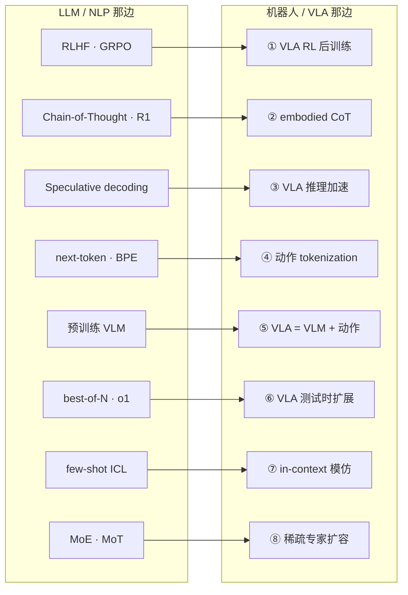

# 🧭 LLM 启发地图——机器人/VLA 从 LLM 借了什么

> [!info] 这是一张「横切透镜」地图，不是研究领域地图
> 另外三张地图（[[推理动力学 主题地图]] / [[强化学习后训练 主题地图]] / [[世界模型 主题地图]]）按**研究领域**分；这张按**「从 LLM 借来的技术」**分——它会横切、重复引用那三张地图里的论文。
> **用法**：每节是一条「借鉴链」——LLM 源头 → 机器人/VLA 落地。读没读、笔记状态在各领域地图里跟踪，这里不重复。
> 关联：[[paper-list]]｜三张领域地图见上。

---

## 1. 这个地图在看什么

**整个 VLA 领域，本质上就是 LLM / VLM 范式迁移到机器人的产物。** 这张图把「借鉴」这件事单独拎出来看：哪一招从 LLM 来、搬到机器人这边变成了什么。

为什么值得单独建这个视角：

- 看清**迁移的模式**——LLM 出一个新技术，往往 6–18 个月后就有机器人版本
- 它是个 **idea 生成器**——「哪个 LLM 技术还没被充分搬过来？」那个空格就是研究机会（详见 §4）

---

## 2. 借鉴链总览

---

## 3. 七条启发方向

### 3.1 ① RL 后训练范式（RLHF / GRPO → VLA RL）

> [!note] 借鉴链
> **LLM 源头**：InstructGPT 的 RLHF（人类反馈 RL 做对齐）→ DeepSeek-R1 的 **GRPO**（去 critic、组内相对 advantage）成为后训练标配。
> **搬到机器人**：把 VLA 当作"会动作的语言模型"，用同一套 RL 范式做后训练。完整谱系见 [[强化学习后训练 主题地图]]。

| 机器人 / VLA 落地 | 怎么用上 LLM 这一招 | arXiv |
| :--- | :--- | :--- |
| **SimpleVLA-RL** | 把 GRPO 直接搬到 OpenVLA-OFT 微调 | [2509.09674](https://arxiv.org/abs/2509.09674) |
| **RIPT-VLA** | GRPO 式 leave-one-out advantage 做交互后训练 | [2505.17016](https://arxiv.org/abs/2505.17016) |
| **TGRPO** | 轨迹级 advantage 融入 GRPO | [2506.08440](https://arxiv.org/abs/2506.08440) |
| （整条线） | online RL 微调、offline-to-online、actor-critic… | → [[强化学习后训练 主题地图]] |

### 3.2 ② Reasoning / Chain-of-Thought（CoT / R1 → embodied reasoning）

> [!note] 借鉴链
> **LLM 源头**：Chain-of-Thought prompting（先想再答）→ DeepSeek-R1 把推理用 RL 训出来。
> **搬到机器人**：让 VLA 在出动作前先推理（计划 / 子目标 / 视觉 grounding）——但纯语义 CoT 不够，要 ground 到感知与机器人状态。

| 机器人 / VLA 落地 | 怎么用上 LLM 这一招 | arXiv |
| :--- | :--- | :--- |
| **ECoT** | 出动作前对计划/子任务/运动/物体框/末端位姿做多步推理（backbone OpenVLA）；OOD +28% | [2407.08693](https://arxiv.org/abs/2407.08693) |
| **CoT-VLA** | "视觉 CoT"：先自回归预测未来图像帧当视觉子目标，再据此生成动作 chunk | [2503.22020](https://arxiv.org/abs/2503.22020) |
| **LaST-R1** | 隐空间 CoT 推理 + LAPO 算法，把 R1 式 reasoning-RL 引入机器人操作 | [2604.28192](https://arxiv.org/abs/2604.28192) |

> 同类可扩展（agent 提到、未单独核实）：Fast ECoT、Training Strategies for Efficient Embodied Reasoning。

### 3.3 ③ 推理加速（speculative decoding 等 → VLA 实时推理）

> [!note] 借鉴链
> **LLM 源头**：speculative decoding（小模型起草 + 大模型并行验证）、KV-cache、并行 / 非自回归解码。
> **搬到机器人**：治 VLA 的部署延迟。完整一节见 [[推理动力学 主题地图]] §3.4。

| 机器人 / VLA 落地 | 怎么用上 LLM 这一招 | arXiv |
| :--- | :--- | :--- |
| **FLASH** | 投机推理：轻量 draft model + 并行验证省掉大部分完整推理。3.04× | [2605.13778](https://arxiv.org/abs/2605.13778) |
| **PD-VLA** | 把自回归解码重写成非线性系统、并行不动点迭代求解 | [2503.02310](https://arxiv.org/abs/2503.02310) |
| **VLASH** | 异步推理——用上一段 chunk roll 出未来状态再推理 | [2512.01031](https://arxiv.org/abs/2512.01031) |

### 3.4 ④ 动作 tokenization & 自回归建模（next-token → 动作即 token）

> [!note] 借鉴链
> **LLM 源头**：next-token prediction、BPE tokenization、decoder-only 自回归 LM。
> **搬到机器人**：把连续动作离散成 token，机器人控制 = 下一 token 预测——这是「VLA」这个词成立的基础。表示侧细节见 [[推理动力学 主题地图]] §3.2。

| 机器人 / VLA 落地 | 怎么用上 LLM 这一招 | arXiv |
| :--- | :--- | :--- |
| **RT-2** | 把机器人动作表示成文本 token，与网络 VQA 数据 co-fine-tune——"动作即 token"的奠基作 | [2307.15818](https://arxiv.org/abs/2307.15818) |
| **FAST** | 基于 DCT 的频域压缩 tokenization + BPE，治高频灵巧动作分箱失效 | [2501.09747](https://arxiv.org/abs/2501.09747) |
| **Discrete Diffusion VLA** | 用离散扩散做动作 token 解码，支持并行解码 + 迭代 refine | [2508.20072](https://arxiv.org/abs/2508.20072) |

### 3.5 ⑤ VLM backbone（VLA = 预训练 VLM + 动作）

> [!note] 借鉴链
> **LLM 源头**：预训练 VLM（LLM 语言模型 + 视觉编码器）。
> **搬到机器人**：VLA 不从零训，而是**拿一个预训练 VLM 当骨架**再加动作能力——这是最根本的一条借鉴，没有它就没有 VLA。

| VLA | backbone VLM | arXiv |
| :--- | :--- | :--- |
| **RT-2** | PaLI-X / PaLM-E | [2307.15818](https://arxiv.org/abs/2307.15818) |
| **OpenVLA** | Prismatic-7B（Llama 2 + DINOv2 + SigLIP） | [2406.09246](https://arxiv.org/abs/2406.09246) |
| **π₀** | PaliGemma（abstract 只写 "a pre-trained VLM"，PaliGemma 见正文/官博） | [2410.24164](https://arxiv.org/abs/2410.24164) |
| **OpenVLA-OFT** | 以 OpenVLA 为 base（间接 Prismatic / Llama 2） | [2502.19645](https://arxiv.org/abs/2502.19645) |

### 3.6 ⑥ Test-time scaling / 验证（best-of-N / o1 → VLA 测试时扩展）

> [!note] 借鉴链
> **LLM 源头**：best-of-N 采样、self-consistency、o1 式 test-time compute、verifier / 过程奖励模型（PRM）。
> **搬到机器人**：推理时多采几个动作、再用 verifier 选最优——不改 VLA 权重就提升成功率。

| 机器人 / VLA 落地 | 怎么用上 LLM 这一招 | arXiv |
| :--- | :--- | :--- |
| **RoboMonkey** | 多采样 + 高斯扰动 + 多数投票构造提案，VLM verifier 选最优；发现动作误差对样本数的指数幂律 | [2506.17811](https://arxiv.org/abs/2506.17811) |
| **RoVer** | 用 Robot 过程奖励模型（PRM）当测试时 verifier，不改权重 | [2510.10975](https://arxiv.org/abs/2510.10975) |
| **MG-Select** | 无 verifier 的 Best-of-N：用与 reference action 的 KL 散度当置信度 | [2510.05681](https://arxiv.org/abs/2510.05681) |

### 3.7 ⑦ In-context learning（few-shot prompting → in-context 模仿学习）

> [!note] 借鉴链
> **LLM 源头**：GPT-3 的 few-shot in-context learning——给几个例子、不更新参数就上手新任务。
> **搬到机器人**：测试时给几条示范轨迹 / 一段示范视频当 prompt，不再训练就执行新任务。

| 机器人 / VLA 落地 | 怎么用上 LLM 这一招 | arXiv |
| :--- | :--- | :--- |
| **ICRT** | 因果 transformer 对感觉运动轨迹做自回归预测，测试时以新任务轨迹当 prompt | [2408.15980](https://arxiv.org/abs/2408.15980) |
| **Vid2Robot** | 以人类示范视频 + 当前状态当 prompt，cross-attention 生成动作 | [2403.12943](https://arxiv.org/abs/2403.12943) |
| **Instant Policy** | 把 in-context 模仿重构为图扩散生成，1–2 个示范即时学会新任务 | [2411.12633](https://arxiv.org/abs/2411.12633) |

### 3.8 ⑧ 架构迁移：MoE / MoT（稀疏专家 → VLA 扩容）

> [!note] 借鉴链
> **LLM 源头**：**MoE**（Switch Transformer / Mixtral / DeepSeek-MoE——router 按 token 动态选少数专家）；**MoT**（Mixture-of-Transformers，arXiv [2411.04996](https://arxiv.org/abs/2411.04996)，按**模态**静态分组参数 + 共享全局注意力，不需学 router）。
> **搬到机器人**：把 VLA 的 action expert / diffusion policy 扩成**稀疏专家**——扩容量、解耦多任务 / 多本体 / 多阶段，又不成比例增加推理开销。机器人这边**以 MoE 为主，真正的 MoT 几乎还没有**。

| 机器人 / VLA 落地 | 怎么用上这一招 | arXiv |
| :--- | :--- | :--- |
| **MoRE** | 多个 LoRA 当专家组成稀疏 MoE + RL 训四足 VLA——少数「MoE × RL」结合，跟我方向最近 | [2503.08007](https://arxiv.org/abs/2503.08007) |
| **AdaMoE** | 把 π₀ 的 action expert FFN 换成稀疏 MoE；scale adapter 解耦「选专家」与「专家权重」，避免 winner-takes-all | [2510.14300](https://arxiv.org/abs/2510.14300) |
| **MoE-DP** | 视觉编码器与 diffusion policy 之间插 MoE 层，专家对应任务阶段（approaching / grasping…），支持长程失败恢复 | [2511.05007](https://arxiv.org/abs/2511.05007) |
| **HiMoE-VLA** | 分层 MoE，逐层自适应处理跨 embodiment / 跨动作空间的异质机器人数据 | [2512.05693](https://arxiv.org/abs/2512.05693) |
| **F1** | 唯一明确自称 MoT 的：understanding / generation / action 三套专用 transformer，动作 = 预见引导的逆动力学 | [2509.06951](https://arxiv.org/abs/2509.06951) |

> [!tip] 关于 π₀
> π₀ 的「VLM + 单个 action expert」**不是 MoE 也不是 MoT**——没有 router、没有稀疏路由。但它是 MoT 思想的 **dense 退化特例**（按功能分两套参数 + 共享注意力），而且正是 AdaMoE 等工作的 dense 基线——它们做的就是「把 π₀ 那个单一 action expert 稀疏化成 MoE」。

> 同类可扩展：DriveMoE（驾驶域双 MoE）、MoLe-VLA（Mixture-of-Layers，路由的是层、目的是推理加速，亦可归 §3.3）、MoE-ACT、SMP、MoS-VLA。

---

## 4. 跟我的关系

这张地图最大的用处不是收论文，是**当 idea 生成器**。看「迁移成熟度」：

| 迁移程度 | 方向 |
| :--- | :--- |
| **已成熟**（大量工作） | ① RL 后训练范式、④ 动作 tokenization、⑤ VLM backbone |
| **进行中**（刚铺开） | ② embodied reasoning、③ 推理加速、⑥ test-time scaling、⑧ MoE 架构 |
| **机器人上还浅** | ⑦ in-context learning（远不如 LLM 那边成熟） |

> [!question] 下一个该被搬过来的 LLM 技术是什么？（这是找 idea 的核心问题）
> 思路：① 哪些 LLM 技术**几乎没有**机器人版本？候选——retrieval-augmented / 外部记忆、长上下文、self-critique / constitutional、多智能体协作。② 已经搬过来的，**搬得糙不糙**？比如 ⑦ in-context learning 在机器人上还很浅，⑥ test-time scaling 才刚起步——糙的地方就是能做深的地方。
> ③ 注意：搬运不是平移——ECoT 那条「纯语义 CoT 不够、必须 ground 到感知」就是机器人侧的真问题。**每一次"搬运"里那个不平凡的适配，才是论文的核心贡献。**

---

## 5. 待补 / 存疑

- [ ] **LLM 源头论文未附 arXiv** —— GRPO / CoT / RLHF 等是概念性引用，本图只给名字；speculative decoding 两篇已在 [[推理动力学 主题地图]] §3.4 有 arXiv
- [ ] **§3.2 可扩展** —— Fast ECoT（arXiv 2506.07639）、Training Strategies for Efficient Embodied Reasoning（2505.08243），agent 提到但未单独核实，需要时核实补入
- [ ] **「LLM 做高层规划 / agent」未收** —— SayCan / Code-as-Policies / PaLM-E 这一支偏高层任务分解，离低层策略 RL 重心稍远，本次没建；以后想跟可单开 §3.8
- [ ] 机器人侧 12 篇 arXiv 均经 agent 逐页核实；新方向遇到同类论文，直接往对应 §3.x 表加一行
