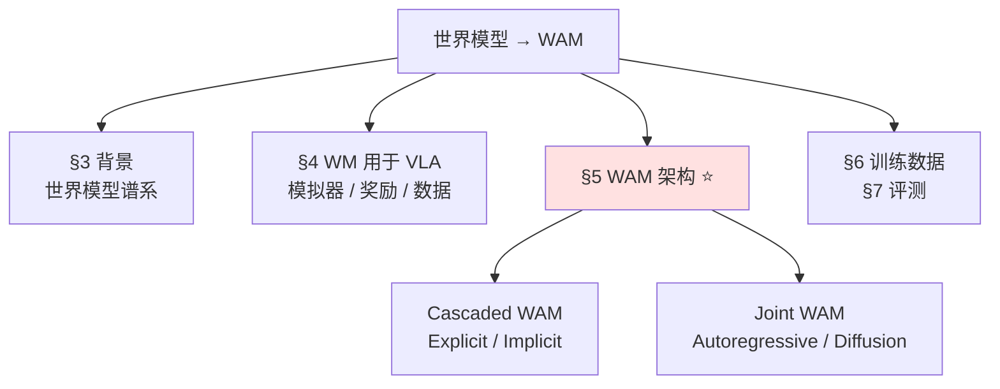

# 🧭 世界模型 → WAM 主题地图

> [!info] 这是主题地图，不是论文笔记
> 按《World Action Models: The Next Frontier in Embodied AI》综述（[2605.12090](https://arxiv.org/abs/2605.12090)，§7）的框架重构。
> **用法**：读完一篇 → 更新「状态」列 → 文章名改 `[[链接]]`；想排期读的移进 [[paper-list]] 的 📖 Reading。
> 关联：[[paper-list]]｜[[强化学习后训练 主题地图]]｜[[推理动力学 主题地图]]｜[[LLM 启发地图]]｜概念：[[Compositional World Model]] [[世界模型架构对比]]｜标签：`#world-model`

---

## 1. 这个主题在问什么

三个概念，一条演化线（综述的核心定义）：

| | 学什么 | 形式 |
| :--- | :--- | :--- |
| **VLA** | 观测直接到动作（反应式） | `p(a \| o, l)` |
| **WM**（世界模型） | 预测环境怎么变 | `p(o' \| o, a)` |
| **WAM**（World Action Model） | **联合**预测未来状态 + 生成动作 | `p(o', a \| o, l)` |

**WAM = 世界模型这条路线在具身 AI 上的「下一前沿」**——给 VLA 装上"预测物理后果"的能力，不再是无世界模型的反应式映射。

> [!note] 为什么是我的主题
> 我已读的 **RISE** 就在这条线上（§4）。这张图是 WAM 领域的地形——§3 是它的根（纯世界模型谱系），§5 是它的主体（WAM 架构），§8 的开放挑战是 idea 富矿。

---

## 2. 框架总览（综述 roadmap）

> **WM 用于 VLA**（§4）：世界模型当**外部工具**（模拟器/奖励/数据生成）——RISE 在这。
> **WAM 架构**（§5）：世界模型**整合进**动作架构本身——这是综述真正的主体。

---

## 3. 背景：世界模型谱系

> 五条"纯世界模型"谱系，是 WAM 的根。读 §5 前对它们有概念即可。

### 3.1 Dreamer / latent imagination

| 文章 | 一句话作用 | 状态 | arXiv |
| :--- | :--- | :--- | :--- |
| **World Models** | VAE + MDN-RNN，在"梦境"rollout 里演化 controller。范式命名作 | ⬜未读 | [1803.10122](https://arxiv.org/abs/1803.10122) |
| **PlaNet** | RSSM 学隐空间动态 + 隐空间 CEM 规划。确立 RSSM 骨架 | ⬜未读 | [1811.04551](https://arxiv.org/abs/1811.04551) |
| **DreamerV1** | 隐空间想象长程轨迹 + actor-critic 解析梯度。latent imagination 开端 | ⬜未读 | [1912.01603](https://arxiv.org/abs/1912.01603) |
| **DreamerV2** | categorical 离散隐变量，攻下 Atari 人类水平 | ⬜未读 | [2010.02193](https://arxiv.org/abs/2010.02193) |
| **DreamerV3** | 鲁棒性技巧，单套超参跨 150+ 任务。MBRL 标准强基线 | ⬜未读 | [2301.04104](https://arxiv.org/abs/2301.04104) |
| **DayDreamer** | Dreamer 直接上物理机器人在线学习 | ⬜未读 | [2206.14176](https://arxiv.org/abs/2206.14176) |

### 3.2 JEPA（非生成式预测）

| 文章 | 一句话作用 | 状态 | arXiv |
| :--- | :--- | :--- | :--- |
| **I-JEPA** | 隐空间预测目标 block 表征，非生成式、无像素重建。范式奠基 | ⬜未读 | [2301.08243](https://arxiv.org/abs/2301.08243) |
| **V-JEPA** | JEPA 扩到视频，masked patch 隐空间特征预测 | ⬜未读 | [2404.08471](https://arxiv.org/abs/2404.08471) |
| **V-JEPA 2** | 百万小时视频预训练 + 真机零样本规划。JEPA 路线首次打通真机 | ⬜未读 | [2506.09985](https://arxiv.org/abs/2506.09985) |

### 3.3 视频生成式世界模型

| 文章 | 一句话作用 | 状态 | arXiv |
| :--- | :--- | :--- | :--- |
| **GAIA-1** | 自动驾驶生成世界模型：token 自回归 + 视频扩散解码 | ⬜未读 | [2309.17080](https://arxiv.org/abs/2309.17080) |
| **Genie** | 从无标注视频学可交互生成环境 + 无监督 latent action | ⬜未读 | [2402.15391](https://arxiv.org/abs/2402.15391) |
| **GameNGen** | 扩散模型实时当游戏引擎（DOOM） | ⬜未读 | [2408.14837](https://arxiv.org/abs/2408.14837) |
| **Cosmos** | NVIDIA，面向 Physical AI 的世界基础模型平台 | ⬜未读 | [2501.03575](https://arxiv.org/abs/2501.03575) |

### 3.4 MuZero / value-equivalent（规划型）

| 文章 | 一句话作用 | 状态 | arXiv |
| :--- | :--- | :--- | :--- |
| **VPN** | 抽象状态只预测 value 不重建观测。MuZero 前身 | ⬜未读 | [1707.03497](https://arxiv.org/abs/1707.03497) |
| **MuZero** | value-equivalence + MCTS 规划，模型只需 value/reward/policy 自洽 | ⬜未读 | [1911.08265](https://arxiv.org/abs/1911.08265) |
| **TD-MPC** | value-equivalent 用于连续控制：隐空间动态 MPC + TD 终值 | ⬜未读 | [2203.04955](https://arxiv.org/abs/2203.04955) |
| **TD-MPC2** | 可规模化版，单超参跨 100+ 连续控制任务。机器人控制强基线 | ⬜未读 | [2310.16828](https://arxiv.org/abs/2310.16828) |

### 3.5 自回归 / token 化世界模型

| 文章 | 一句话作用 | 状态 | arXiv |
| :--- | :--- | :--- | :--- |
| **TransDreamer** | Transformer State-Space Model 替 RNN。首个 Transformer 随机 WM | ⬜未读 | [2202.09481](https://arxiv.org/abs/2202.09481) |
| **IRIS** | 图像编成 token + 自回归 Transformer 建模动态。Atari 100k SOTA | ⬜未读 | [2209.00588](https://arxiv.org/abs/2209.00588) |
| **Δ-IRIS** | 只编码时间步之间的 delta，大幅减 token 数 | ⬜未读 | [2406.19320](https://arxiv.org/abs/2406.19320) |

---

## 4. WM 用于 VLA（世界模型当外部工具）

> 综述的关键区分：这里世界模型是**外部工具**——当模拟器、奖励源、数据生成器训 / 评 VLA，**不整合进策略架构**。跟 [[强化学习后训练 主题地图]] §3.4 重叠。

| 文章 | 用途 | 一句话作用 | 状态 | arXiv |
| :--- | :--- | :--- | :--- | :--- |
| **RISE** | RL | compositional WM（dynamics + value）在想象空间做 on-policy RL，零真机 trial | ✅已读 | [[RISE  Self-Improving Robot Policy with Compositional World Model\|笔记]] |
| **WMPO** | RL | 像素预测 WM 生成想象轨迹，做 on-policy GRPO | ⬜未读 | [2511.09515](https://arxiv.org/abs/2511.09515) |
| **SC-VLA** | RL | sparse world imagination（辅助头预报进度 + 轨迹）+ online action refinement 重塑奖励，自改进不靠外部奖励。RISE 的轻量对照 | ⬜未读 | [2602.21633](https://arxiv.org/abs/2602.21633) |
| **VLA-RFT** | 奖励 | WM 模拟器提供 verified dense reward 做强化微调 | ⬜未读 | [2510.00406](https://arxiv.org/abs/2510.00406) |
| **DiWA** | RL | play 训练的 WM，完全离线 RL 微调 diffusion policy | ⬜未读 | [2508.03645](https://arxiv.org/abs/2508.03645) |
| **VIPER** | 奖励 | 用预训练视频预测模型当 action-free reward | ⬜未读 | [2305.14343](https://arxiv.org/abs/2305.14343) |
| **Diffusion Reward** | 奖励 | 从条件视频扩散的熵导出奖励 | ⬜未读 | [2312.14134](https://arxiv.org/abs/2312.14134) |
| **Ctrl-World** | IL | 可控生成 WM，合成成功轨迹做 SFT 数据增广 | ⬜未读 | [2510.10125](https://arxiv.org/abs/2510.10125) |

---

## 5. WAM 架构 ⭐（世界模型整合进动作架构）

> 综述主体。顶层二分：**Cascaded**（分阶段：先预测世界状态、再导出动作）vs **Joint**（统一架构联合建模）。论文为各格代表作，完整清单见综述 Table 1/2/3。

### 5.1 Cascaded WAM（分阶段流水线）

**5.1a Explicit——像素空间规划**（先生成未来视频/帧，再抽动作）

| 文章 | 一句话作用 | 状态 | arXiv |
| :--- | :--- | :--- | :--- |
| **UniPi** | 奠基两阶段：文本条件视频扩散合成执行视频 + IDM 回归动作 | ⬜未读 | [2302.00111](https://arxiv.org/abs/2302.00111) |
| **VLP** | 加 VLM 做分层子目标 + 树搜索打分，治视频长程语义漂移 | ⬜未读 | [2310.10625](https://arxiv.org/abs/2310.10625) |
| **AVDC** | 几何抽取：扩散生成视频 → 算稠密光流 → 解析 SE(3)，无需动作标注 | ⬜未读 | [2310.08576](https://arxiv.org/abs/2310.08576) |
| **TesserAct** | 视频预测目标扩到 RGB-D-法向，引入显式 4D 几何约束 | ⬜未读 | [2504.20995](https://arxiv.org/abs/2504.20995) |

**5.1b Implicit——隐空间规划**（中间载体是隐表示，不解码回像素）

| 文章 | 一句话作用 | 状态 | arXiv |
| :--- | :--- | :--- | :--- |
| **VPP** | VAE 编码 + 扩散单步预测未来隐序列 + 轻量策略。首次实时 | ⬜未读 | [2412.14803](https://arxiv.org/abs/2412.14803) |
| **villa-X** | 隐动作建模：proprio-FDM 把隐动作 ground 到物理 + 联合扩散 | ⬜未读 | [2507.23682](https://arxiv.org/abs/2507.23682) |
| **Video Policy** | 冻结视频 U-Net，单独训 action U-Net 从其中间特征解码动作 | ⬜未读 | [2508.00795](https://arxiv.org/abs/2508.00795) |

### 5.2 Joint WAM（统一架构联合建模）

**5.2a Autoregressive——自回归联合预测**

| 文章 | 一句话作用 | 状态 | arXiv |
| :--- | :--- | :--- | :--- |
| **GR-2** | 视频预训练 transformer，离散 VQGAN 视觉规划 + 连续动作 chunk | ⬜未读 | [2410.06158](https://arxiv.org/abs/2410.06158) |
| **CoT-VLA** | 视觉 CoT：先自回归生成未来帧当视觉子目标，再生成动作 | ⬜未读 | [2503.22020](https://arxiv.org/abs/2503.22020) |
| **WorldVLA** | 自回归动作世界模型，模态特定因果掩码强制 ground 历史 | ⬜未读 | [2506.21539](https://arxiv.org/abs/2506.21539) |
| **VLA-JEPA** | JEPA 路线的 joint：隐动作 token 引导自回归世界模型，无泄漏 | ⬜未读 | [2602.10098](https://arxiv.org/abs/2602.10098) |
| **F1** | MoT 三专家（understanding/generation/action），动作 = 预见引导逆动力学 | ⬜未读 | [2509.06951](https://arxiv.org/abs/2509.06951) |

**5.2b Diffusion-based——扩散联合生成**

| 文章 | 一句话作用 | 状态 | arXiv |
| :--- | :--- | :--- | :--- |
| **UWM** | 单 DiT，世界与动作各自独立噪声调度——测试时切策略/WM/IDM/纯视频 | ⬜未读 | [2504.02792](https://arxiv.org/abs/2504.02792) |
| **Cosmos Policy** | Cosmos-Predict2 骨架 + latent frame injection，单 checkpoint 当策略+WM+value | ⬜未读 | [2601.16163](https://arxiv.org/abs/2601.16163) |
| **LDA-1B** | MM-DiT，按数据质量分配角色；DINO 隐空间预测未来 | 📥队列中 | [2602.12215](https://arxiv.org/abs/2602.12215) |
| **UVA** | 共享 transformer 编历史观测+动作+masked 未来观测，双扩散头解视频/动作 | ⬜未读 | [2503.00200](https://arxiv.org/abs/2503.00200) |
| **DreamZero** | 建在 Wan2.1 I2V，联合去噪视频+动作隐；KV-cache 观测替换治漂移 | ⬜未读 | [2602.15922](https://arxiv.org/abs/2602.15922) |
| **DiT4DiT** | DiT 主干联合建模视频动力学 + 动作做通用机器人控制；这条线很有影响力的工作（细节待读完核实） | 📥队列中 | [2506.17518](https://arxiv.org/abs/2506.17518) |

> 你库里的 **DyWA**（[2503.16806](https://arxiv.org/abs/2503.16806)，📥队列中）也是 Joint WAM（dynamics-adaptive world action model），综述未单独收录，AR / Diffusion 归类待读原文核实。

---

## 6. 训练数据生态

> WAM 的瓶颈是数据。四类数据源，按「迁移难度 × 扩展难度」权衡（综述 Fig 7）。

| 数据源 | 特点 | 代表 |
| :--- | :--- | :--- |
| **机器人遥操作** | 高质量、精确动作标注，零 sim2real gap；贵、难扩展 | OXE · AgiBot World · DROID |
| **便携人类示范（UMI 式）** | 便携采集、保真好、成本低；桥接真机与视频 | UMI · FastUMI · RDT2 |
| **仿真** | 可无限扩展、有特权信息（深度/位姿）；有 domain gap | MimicGen · RoboCasa · RoboTwin |
| **第一视角人类视频** | 互联网级被动物理先验；无动作标注、迁移难 | Ego4D · EgoDex · SSv2 |

> 这条轴跟 [[推理动力学 主题地图]] §3.1（UMI / GELLO 采集接口）直接呼应。

---

## 7. 评测

综述指出当前评测「割裂」——世界建模和动作分开评，缺联合度量。两条轴：

- **世界建模能力**
  - 视觉保真：PSNR / SSIM / LPIPS / DreamSim / FVD
  - 物理常识：VideoPhy / PhyGenBench / VBench-2.0 / WorldModelBench / Physics-IQ
  - 动作合理性：WorldSimBench / 「Wow, wo, val!」（IDM 图灵测试——很多视觉逼真的模型在此崩到接近 0）
- **动作策略能力**：LIBERO / RoboTwin / SimplerEnv / COLOSSEUM 等（详见 [[强化学习后训练 主题地图]] §3.6 综述行）

---

## 8. 跟我的关系 + 开放挑战

WAM 是「世界模型 × RL/VLA」的交汇——正是我方向的核心。综述 §7 给了 **7 个开放挑战**，这是找 idea 的富矿：

| # | 开放挑战 | 对我的意味 |
| :--- | :--- | :--- |
| 1 | **架构耦合**：显式像素预测到底必不必要？ | latent-predictive（JEPA 式）可能绕开像素瓶颈——**这正是我地图里早埋的那个问题**，综述列为头号挑战 |
| 2 | **多模态物理状态表示**：超越 RGB，联合预测触觉 / 力 | 接触密集操作的盲点——**直接对应灵巧手**，几乎空白 |
| 3 | 数据混合设计：人类视频 vs 机器人数据最优配方 | 信息论视角的 data mixture |
| 4 | 长程规划与时间抽象 | 分层 WAM |
| 5 | 推理延迟：WAM 的 "latency tax" | 接 [[推理动力学 主题地图]] §3.4 |
| 6 | 评测方法：缺「想象与动作的因果一致性」联合度量 | §7 那条 |
| 7 | 安全：预测式能力既是优势，也使失败更严重 | prediction-integrated safety |

> [!question] 我的切入点
> 挑战 ① 和 ②（×灵巧手）对我最有意思。①：RISE 用视频扩散做 dynamics，JEPA 主张别重建像素——综述明说「未有系统对照实验」，这是个能做的实证题。②：多模态（触觉/力）WAM × 灵巧手几乎是空白。
> _读够 §5 几篇代表作再回来收敛。_

---

## 9. 待补 / 存疑

- [ ] §5 各格只列了代表作，完整清单见综述 Table 1/2/3；遇到同类直接往对应格加行
- [ ] **DyWA 的 Cascaded/Joint 归类待核实**（综述未收录）
- [ ] RISE 的 arXiv = 2602.11075（综述 ref [43]）
- [ ] 读完更新「状态」列 + 文章名改 `[[链接]]`
- [ ] **概念笔记**：[[Compositional World Model]]（已有）；[[世界模型架构对比]]（待填）——§5 的 Cascaded/Joint 二分正是它的素材；候选新概念「Cascaded vs Joint WAM」

---

## Backlinks
（Obsidian 自动维护）
