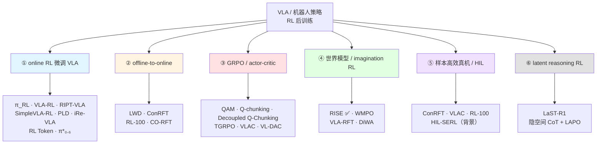

# 🧭 强化学习后训练（主题地图）

> [!info] 这是主题地图，不是论文笔记
> 把「VLA / 机器人策略的 RL 后训练」这个主题的文章按子角度排好，跟踪读没读——**这是我核心方向的领域地形图**。
> **用法**：读完一篇 → 更新「状态」列 → 把文章名改成 `[[链接]]` 指向 `papers/` 笔记；想排期读的移进 [[paper-list]] 的 📖 Reading。
> 关联：[[paper-list]]（阅读队列）｜[[推理动力学 主题地图]]（底座主题）｜标签：`#RL` `#post-training`

---

## 1. 这个主题在问什么

**有了一个预训练好的机器人策略 / VLA，怎么用强化学习让它更强——而不从头训、也不破坏预训练知识？**

这个问题里有几对反复出现的张力：

- **RL 信号从哪来** —— 真机交互？仿真器？世界模型想象？人类干预？
- **奖励怎么定义** —— 稀疏成功信号？学一个 reward / critic 模型？world-model verified reward？
- **怎么不破坏预训练** —— 微调全模型？加 residual / 小 head？anchoring 到原模型？
- **算法范式** —— PPO？GRPO？actor-critic？advantage-conditioned？offline-to-online？

> [!note] 为什么这是我的主战场
> 我的方向就是 [[RL 与模型后训练]]。这张图不是"待读清单"，而是**我整个领域的地形图**——看清有哪些路线、谁和谁对照、空白在哪。详见 §4。

---

## 2. 子角度分类图

> 几篇是跨角度的（ConRFT / VLAC / RL-100 同时属 ② / ③ / ⑤）——在 §3 里每篇只列在主归属那一节，其余处只提名字。

---

## 3. 关键文章

> 「相关度」：核心 / 相关 / 边缘。「状态」：✅已读 / 📥队列中（在 paper-list）/ ⬜未读。
> 读完一篇后：更新状态 + 文章名改 `[[wiki-link]]`。

### 3.1 ① online RL 微调预训练 VLA

| 文章 | 一句话作用 | 相关度 | 状态 | arXiv |
| :--- | :--- | :--- | :--- | :--- |
| **RL Token** | 极简侵入：冻结主体 + 紧凑「RL token」读出表示 + 小 actor-critic head，真机几分钟到几小时精炼动作 | 核心 | 📥队列中 | [2604.23073](https://arxiv.org/abs/2604.23073) |
| **π_RL** | flow-based VLA 的 online RL——Flow-Noise / Flow-SDE 解决 flow 策略 action log-likelihood 不可解的难题 | 核心 | ⬜未读 | [2510.25889](https://arxiv.org/abs/2510.25889) |
| **VLA-RL** | 轨迹级 online RL + 把一个 VLM 微调成 robotic process reward model 治稀疏奖励；OpenVLA-7B 超最强微调基线 | 核心 | ⬜未读 | [2505.18719](https://arxiv.org/abs/2505.18719) |
| **RIPT-VLA** | 仅用稀疏二值成功奖励做交互式后训练，核心是动态 rollout + leave-one-out advantage 稳定优化 | 核心 | ⬜未读 | [2505.17016](https://arxiv.org/abs/2505.17016) |
| **SimpleVLA-RL** | 基于 OpenVLA-OFT 的 GRPO 框架，数据稀缺下靠探索增强 scale 长程规划 | 核心 | ⬜未读 | [2509.09674](https://arxiv.org/abs/2509.09674) |
| **PLD**（Probe-Learn-Distill） | 冻结 VLA backbone + 轻量 residual actor 探失败区 → 分布对齐数据采集 → 蒸馏回 generalist；含灵巧手，真机 100% | 核心 | ⬜未读 | [2511.00091](https://arxiv.org/abs/2511.00091) |
| **π*₀.₆**（即 RECAP 论文） | "从经验中学习"的 VLA；RECAP 是其中的 advantage-conditioned 方法，RISE 继承并修正了它 | 核心 | ⬜未读 | [2511.14759](https://arxiv.org/abs/2511.14759) |
| **iRe-VLA** | RL 阶段与监督阶段交替——兼顾 RL 探索收益与监督学习稳定性，稳住大 VLA 的 RL | 相关 | ⬜未读 | [2501.16664](https://arxiv.org/abs/2501.16664) |
| **What Can RL Bring to VLA Generalization** | 经验研究：系统对比 RL（尤 PPO）vs SFT 在语义理解 / 执行鲁棒性上的泛化 | 相关 | ⬜未读 | [2505.19789](https://arxiv.org/abs/2505.19789) |

### 3.2 ② offline-to-online RL

| 文章 | 一句话作用 | 相关度 | 状态 | arXiv |
| :--- | :--- | :--- | :--- | :--- |
| **LWD**（Learning while Deploying） | 舰队规模 offline-to-online RL：16 台真机部署数据 + DIVL 分布式值学习 + QAM 策略抽取 | 核心 | 📥队列中 | [agibot](https://finch.agibot.com/research/lwd) |
| **ConRFT** | consistency policy 统一目标：离线阶段 BC + Q-learning 稳值估计 → 在线阶段 + 人类干预探索；真机 96.3% | 核心 | ⬜未读 | [2502.05450](https://arxiv.org/abs/2502.05450) |
| **RL-100** | diffusion visuomotor policy，去噪过程内用单一 clipped PPO 统一 IL + RL，consistency distill 一步部署 | 核心 | ⬜未读 | [2510.14830](https://arxiv.org/abs/2510.14830) |
| **CO-RFT** | 模仿学习初始化 + 带 action chunking 的离线 RL，30–60 条示范即可优化（接 [[推理动力学 主题地图]] 的 chunk 思路） | 相关 | ⬜未读 | [2508.02219](https://arxiv.org/abs/2508.02219) |

### 3.3 ③ GRPO / actor-critic 风格

| 文章 | 一句话作用 | 相关度 | 状态 | arXiv |
| :--- | :--- | :--- | :--- | :--- |
| **QAM**（Q-learning with Adjoint Matching） | critic 梯度经 adjoint matching 转成 flow 策略的逐步监督——LWD 的 policy extraction 用它 | 核心 | 📥队列中 | [2601.14234](https://arxiv.org/abs/2601.14234) |
| **Q-chunking** | 把 action chunking 引入 TD-RL，治长程稀疏奖励的探索 + n-step backup 稳定性 | 核心 | 📥队列中 | [2507.07969](https://arxiv.org/abs/2507.07969) |
| **Decoupled Q-Chunking** | Q-chunking 改进：critic 与 policy 的 chunk 长度解耦，策略更短更 reactive | 相关 | 📥队列中 | [2512.10926](https://arxiv.org/abs/2512.10926) |
| **TGRPO** | 把轨迹级 advantage 融入 GRPO 的组内相对 advantage + LLM 生成稠密奖励 | 核心 | ⬜未读 | [2506.08440](https://arxiv.org/abs/2506.08440) |
| **VLAC** | 基于 InternVL 的 Vision-Language-Action-Critic，统一输出稠密奖励 + 动作 token，HIL 加速 | 核心 | ⬜未读 | [2509.15937](https://arxiv.org/abs/2509.15937) |
| **VL-DAC** | Vision-Language Decoupled Actor-Critic：action token 做 PPO、环境步级别学 value；偏 agentic VLM | 边缘 | ⬜未读 | [2508.04280](https://arxiv.org/abs/2508.04280) |

### 3.4 ④ 世界模型 / imagination-based RL 后训练

> 这一节跟我已读的 RISE 直接对照，也连着 [[Compositional World Model]] 概念笔记。

| 文章 | 一句话作用 | 相关度 | 状态 | arXiv |
| :--- | :--- | :--- | :--- | :--- |
| **RISE** | compositional world model（dynamics + value）在想象空间做 on-policy RL，零真机 trial | 核心 | ✅已读 | [[RISE  Self-Improving Robot Policy with Compositional World Model\|笔记]] |
| **WMPO** | 像素预测世界模型生成「想象」轨迹（对齐 web-scale 预训练特征），不碰真机做 on-policy GRPO | 核心 | ⬜未读 | [2511.09515](https://arxiv.org/abs/2511.09515) |
| **VLA-RFT** | 数据驱动的世界模型模拟器提供 verified dense reward 做强化微调，少量步即鲁棒提升 | 核心 | ⬜未读 | [2510.00406](https://arxiv.org/abs/2510.00406) |
| **DiWA** | 用 play 交互训练的世界模型，**完全离线**用 RL 微调 diffusion policy（非 VLA），大幅省真机交互 | 相关 | ⬜未读 | [2508.03645](https://arxiv.org/abs/2508.03645) |
| **SC-VLA** | sparse world imagination + online action refinement：辅助头预报稀疏未来、重塑奖励做自改进——RISE 的轻量对照 | 核心 | ⬜未读 | [2602.21633](https://arxiv.org/abs/2602.21633) |

### 3.5 ⑤ 样本高效真机 / human-in-the-loop

> 主力 **ConRFT（§3.2）/ VLAC（§3.3）/ RL-100（§3.2）** 都同属此类——它们的共同点是「真机 + 人类干预 + 少量 episode」。这里只补一篇奠基背景：

| 文章 | 一句话作用 | 相关度 | 状态 | arXiv |
| :--- | :--- | :--- | :--- | :--- |
| **HIL-SERL** | human-in-the-loop 样本高效真机 RL 的奠基工作（非 VLA 本体），是 ⑤ 这条线的源头 | 相关 · 背景 | ⬜未读 | _2410.21845（待核实）_ |

### 3.6 ⑥ latent reasoning RL（隐空间推理 + RL）

> 一条**新分支**：先在隐空间做 reasoning / Chain-of-Thought，再把推理结果优化到动作——把 LLM 的 reasoning-RL（R1 风格训练）思路引入机器人操作。目前还很新，先收一篇代表作，后续遇到同类再扩成完整一节。

| 文章 | 一句话作用 | 相关度 | 状态 | arXiv |
| :--- | :--- | :--- | :--- | :--- |
| **LaST-R1** | 把 latent Chain-of-Thought 推理 + 动作优化结合，用 **LAPO**（Latent-to-Action Policy Optimization）算法强化机器人操作；仿真接近满分，真机显著超监督学习 | 核心 | ⬜未读 | [2604.28192](https://arxiv.org/abs/2604.28192) |

### 3.7 框架 & 综述

| 文章 | 一句话作用 | 类型 | 状态 | arXiv |
| :--- | :--- | :--- | :--- | :--- |
| **RLinf-VLA** | 统一 VLA + RL 框架：标准化集成 OpenVLA / -OFT × PPO / GRPO × 多模拟器，1.6–1.9× 训练加速 | 框架 / 工具 | ⬜未读 | [2510.06710](https://arxiv.org/abs/2510.06710) |
| **Pure VLA Models: A Comprehensive Survey** | 综合 300+ 篇，把 VLA 分为自回归 / diffusion / hybrid / reinforcement-based，含 RL 章节 | 综述 | ⬜未读 | [2509.19012](https://arxiv.org/abs/2509.19012) |
| **State Representation Learning for DRL**（综述） | RL 中 state 表示学习的系统综述——把 state 放在比 reward 更核心的位置（state-centric RL）；SRL 是 RSSM / JEPA / contrastive / bisimulation 等的共同上位词 | 综述 | 📥队列中 | [2603.10448](https://arxiv.org/abs/2603.10448) |

---

## 4. 跟我的关系

这是我的**主战场**。读这片文献时，抓两个东西：

**① 一根对照轴：RL 信号来源 × 对预训练模型的侵入程度。** 这就是之前 RISE / LWD / RL Token 那张小表的放大版：

| | 信号来源 | 侵入程度 |
| :--- | :--- | :--- |
| 想象空间 | RISE · WMPO · VLA-RFT · DiWA | 中 |
| 真机舰队 / 在线 | LWD · RL-100 · ConRFT · VLAC | 中 |
| 最小侵入（冻结 + 小 head / residual） | RL Token · PLD | 低 |

**② 三条并行的方法主线**，各挑代表深读，别平均用力：

- **GRPO 簇** —— SimpleVLA-RL / RIPT-VLA / TGRPO：当下最热，把 LLM 的 GRPO 搬到 VLA
- **世界模型簇** —— RISE（已读）/ WMPO / VLA-RFT：RISE 的天然近亲，对照最省力
- **offline-to-online 簇** —— LWD / ConRFT / RL-100：工程落地最成熟的一路

> [!question] 我的切入点在哪？（读够 5-6 篇后回来填）
> 提示方向：① 这些方案的 reward / value 模型大多还是脆的——有没有更稳的？② 灵巧手场景里它们几乎没人碰，PLD 是少数——这是不是空白？③ 想象空间 vs 真机两条路能不能融合？
> _现在别急着下结论，先读。_

---

## 5. 待补 / 存疑

- [ ] **HIL-SERL 的 arXiv 号待核实** —— 标注的 2410.21845 来自二手信息，没逐页核实，引用前自己确认（Science Robotics 2025 有正式版）
- [ ] 另有一篇 "Survey on RL of VLA for Robotic Manipulation" 只在 TechRxiv 见到、无 arXiv 条目——主题最贴合，但**未核实**，需要时自己找正式版
- [ ] 读完任一篇：更新「状态」列 + 文章名改 `[[链接]]`，想排期读的移进 [[paper-list]] 的 📖 Reading
- [ ] **可抽 / 已有的概念笔记**：
  - [[Advantage-conditioned 微调]] —— 已有，RECAP / RISE 的范式
  - [[Compositional World Model]] —— 已有，§3.4 那一簇的设计哲学
  - 候选新概念：「offline-to-online RL」「GRPO for VLA」够格各做一个——读到第 2 个实例就建

---

## Backlinks
（Obsidian 自动维护）
