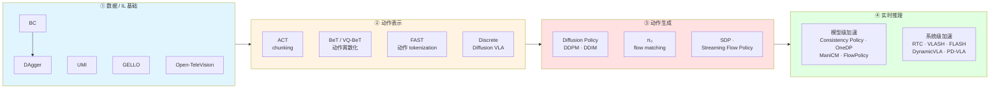

# 🧭 推理动力学（主题地图）

> [!info] 这是主题地图，不是论文笔记
> 把「推理动力学」主题相关的文章按脉络排好，跟踪读没读——**导航用，不做精读**。
> **用法**：读完一篇 → 更新「状态」列 → 把文章名改成 `[[链接]]` 指向新建的 `papers/` 笔记。
> 关联：[[paper-list]]（阅读队列）｜[[强化学习后训练 主题地图]]（上层主题）｜标签：`#inference-dynamics`

---

## 1. 这个主题在问什么

一个机器人策略，从拿到观测到吐出**能执行的动作**，中间经历什么？这个主题把这条链路拆开：

- **策略怎么来** —— 模仿学习：BC 的复合误差问题、DAgger 的修正
- **数据怎么采** —— UMI / GELLO 这类便携采集接口，解耦「采数据」和「机器人本体」
- **动作怎么表示** —— 单步 vs action chunk（ACT）；连续 vs 离散 token（VQ-BeT / FAST）
- **动作怎么生成** —— 扩散去噪、flow matching、streaming 生成（Diffusion Policy / π₀ / SDP）
- **部署时怎么实时执行** —— 模型级加速（蒸馏成少步）+ 系统级加速（异步 / 投机 / 并行 / 衔接）

> [!note] 为什么这条线对我重要
> 我方向（[[强化学习后训练 主题地图]]）里的 RISE / LWD / Q-chunking / QAM **全都假设「策略输出 action chunk」**。这个 chunk 从哪来、怎么生成、部署时怎么不卡——就是这条线回答的。**不补这条线，RL 那条线是悬空的。** 详见 §4。

---

## 2. 脉络图

> 一条线读下来：**模仿学习拿到策略 → 把动作表示成 chunk / token → 用扩散或 flow 生成 → 解决在真机上的实时执行**。

---

## 3. 关键文章

> 「状态」列：未读 / 在读 / ✅ 已读。读完后把文章名改成 `[[wiki-link]]`。

### 3.1 数据 / IL 基础

| 文章 | 一句话作用 | 经典 / 前沿 | 状态 | arXiv |
| :--- | :--- | :--- | :--- | :--- |
| **BC**（Behavior Cloning） | 最朴素的模仿学习——把（观测 → 专家动作）当监督回归。简单，但部署一偏离就误差累积 | 经典 · 基石 | 未读 | 方法本身，无单篇 |
| **DAgger** | 让策略先跑，在它**实际访问到的状态**上找专家标注、迭代聚合数据，把训练分布对齐到部署分布——治 BC 的复合误差 | 经典（2011） | 未读 | [1011.0686](https://arxiv.org/abs/1011.0686) |
| **UMI**（Universal Manipulation Interface） | 手持夹爪 + 相机的便携采集接口，真实世界各种场景直接采操作数据，数据可迁移训机器人策略 | 近期 · 数据接口（2024） | 未读 | [2402.10329](https://arxiv.org/abs/2402.10329) |
| **GELLO** | 3D 打印件 + 廉价电机搭一个与目标机械臂**同运动学结构**的低成本主控臂，关节一一映射做遥操作采数据；Franka/UR5/xArm 已适配、全开源 | 近期 · 数据接口（2023） | 未读 | [2309.13037](https://arxiv.org/abs/2309.13037) |
| **Open-TeleVision** | VR 头显 + 机器人主动立体相机，把第一视角 3D 观测实时回传操作者、镜像其手臂手部动作；用于人形机器人采数据。偏遥操作系统 | 近期 · 遥操作（2024） | 未读 | [2407.01512](https://arxiv.org/abs/2407.01512) |

### 3.2 动作表示

| 文章 | 一句话作用 | 经典 / 前沿 | 状态 | arXiv |
| :--- | :--- | :--- | :--- | :--- |
| **ACT**（Action Chunking with Transformers） | Transformer + CVAE 一次预测一段动作（action chunk），配 temporal ensembling 平滑执行——解决单步预测的误差累积和抖动。ALOHA 那篇 | 经典 · 已成标准（2023） | 未读 | [2304.13705](https://arxiv.org/abs/2304.13705) |
| **BeT**（Behavior Transformer） | 在 transformer 上加**动作离散化** + 多模 offset 修正，建模无标签多模态示范的连续动作。VQ-BeT 的前作 | 经典 · 动作离散化（2022） | 未读 | [2206.11251](https://arxiv.org/abs/2206.11251) |
| **VQ-BeT**（Behavior Generation with Latent Actions） | 用**分层残差 VQ-VAE** 把连续动作离散成 token，再用 GPT 式 transformer 建模动作 token 分布；比 Diffusion Policy 推理快约 5× | 前沿 · 动作离散化（2024） | 未读 | [2403.03181](https://arxiv.org/abs/2403.03181) |
| **FAST** | 基于 DCT 的**频域压缩 tokenization** + BPE——朴素逐维分箱在高频灵巧任务上失效，FAST 把动作压成稠密 token；配 π₀ 可扩到 1 万小时数据 | 前沿 · 动作 tokenization（2025） | 未读 | [2501.09747](https://arxiv.org/abs/2501.09747) |
| **Discrete Diffusion VLA** | 在统一 transformer 里用**离散扩散**做动作 token 解码，支持并行解码 + 迭代 refine——治自回归 VLA 逐 token 解码慢、一致性差。横跨表示/生成 | 前沿（2025） | 未读 | [2508.20072](https://arxiv.org/abs/2508.20072) |

### 3.3 动作生成

> 「动作怎么生成」：从条件扩散（Diffusion Policy，底层 DDPM / DDIM）、flow matching（π₀），到 streaming 生成（边生成边执行）。

| 文章 | 一句话作用 | 经典 / 前沿 | 状态 | arXiv |
| :--- | :--- | :--- | :--- | :--- |
| **Diffusion Policy** | 把动作生成建模成**条件去噪扩散**——能表达多模态动作分布（同一观测下多个合理动作），生成 action chunk | 经典 · 已成标准（2023） | 未读 | [2303.04137](https://arxiv.org/abs/2303.04137) |
| **DDPM** | 去噪扩散概率模型——前向加噪、反向逐步去噪。扩散生成模型的基石，Diffusion Policy 的训练/采样底座 | 经典 · 生成模型基石（2020） | 未读 | [2006.11239](https://arxiv.org/abs/2006.11239) |
| **DDIM** | 确定性、可跳步的采样器，把 DDPM 几百步采样压到几十步——**部署时推理提速的关键** | 经典 · 采样加速（2021） | 未读 | [2010.02502](https://arxiv.org/abs/2010.02502) |
| **π₀** | 预训练 VLM 上接独立 **action expert**，用 **flow matching** 生成连续动作 chunk；在单臂 / 双臂 / 移动操作多平台数据上训练。flow matching 策略代表作 | 前沿 · flow VLA（2024） | 未读 | [2410.24164](https://arxiv.org/abs/2410.24164) |
| **SDP**（Streaming Diffusion Policy） | 输出一条**变噪声水平**的动作序列（近期动作干净、远期噪声渐高），每步只对上条轨迹做少量去噪即可滚动产出可执行动作 | 前沿 · streaming（2024） | 未读 | [2406.04806](https://arxiv.org/abs/2406.04806) |
| **Streaming Flow Policy** | 不从噪声采样，而从上一动作附近的窄高斯起步、沿 flow matching 速度场积分——采样过程中即可把动作流式发给机器人 | 前沿 · streaming（2025, CoRL） | 未读 | [2505.21851](https://arxiv.org/abs/2505.21851) |

### 3.4 实时推理

> 治推理延迟有两条路：**模型级**（把多步扩散蒸馏成单步 / 少步生成）和**系统级**（异步 / 投机 / 并行 / chunk 衔接）。

**3.4a 模型级加速（蒸馏成单步 / 少步）**

| 文章 | 一句话作用 | 经典 / 前沿 | 状态 | arXiv |
| :--- | :--- | :--- | :--- | :--- |
| **Consistency Policy** | 沿预训练 Diffusion Policy 的去噪轨迹施加**自一致性约束**做 consistency distillation，得到可单步/少步推理的策略，提速约一个数量级 | 前沿（2024, RSS） | 未读 | [2405.07503](https://arxiv.org/abs/2405.07503) |
| **OneDP**（One-Step Diffusion Policy） | 沿扩散链最小化 KL，把预训练扩散策略**蒸馏成单步**动作生成器；动作频率 1.5 Hz → 62 Hz，额外预训练成本仅 2–10% | 前沿（2024） | 未读 | [2410.21257](https://arxiv.org/abs/2410.21257) |
| **ManiCM** | 对扩散过程施加一致性约束，从**点云**观测单步生成动作；31 个任务平均提速约 10× | 前沿 · 3D（2024） | 未读 | [2406.01586](https://arxiv.org/abs/2406.01586) |
| **FlowPolicy** | **consistency flow matching** + 3D 点云，对速度场做自一致性归一化实现单步生成；提速约 7× | 前沿 · 3D（2024, AAAI Oral） | 未读 | [2412.04987](https://arxiv.org/abs/2412.04987) |

**3.4b 系统级加速（异步 / 投机 / 并行 / 衔接）**

| 文章 | 一句话作用 | 经典 / 前沿 | 状态 | arXiv |
| :--- | :--- | :--- | :--- | :--- |
| **RTC**（Real-Time Chunking） | chunk 策略实时执行时，新 chunk 生成期间机器人还在跑旧 chunk，衔接处会跳变；RTC 对下一段做 inpainting/引导让 chunk 平滑接续。Physical Intelligence | 前沿（2025） | 未读 | [2506.07339](https://arxiv.org/abs/2506.07339) |
| **VLASH**（Future-State-Aware Asynchronous Inference） | 推理与执行同时发生时机器人状态已变 →「时间错位」致动作不稳；VLASH 用上一段 chunk 把状态向前 roll 出「未来执行时刻状态」再推理，异步、实时、不掉精度 | 前沿（2025.12） | 未读 | [2512.01031](https://arxiv.org/abs/2512.01031) |
| **DynamicVLA**（Dynamic Object Manipulation） | 针对操作**运动中的物体**：轻量 0.4B VLA + 卷积视觉编码 + Continuous Inference（推理与执行重叠）+ Latent-aware Action Streaming；附 benchmark | 前沿（2026.01） | 未读 | [2601.22153](https://arxiv.org/abs/2601.22153) |
| **FLASH**（Realtime-VLA, Speculative Inference） | diffusion-based VLA 的**投机推理**：轻量 draft model + 并行验证省掉 replanning 时大部分完整推理调用，配 fallback。3.04× 提速，LIBERO 不掉性能 | 前沿（2026.05） | 未读 | [2605.13778](https://arxiv.org/abs/2605.13778) |
| **PD-VLA**（Parallel Decoding） | action chunking 使单次推理动作维度剧增、自回归逐 token 解码时间线性增长；PD-VLA 把自回归解码重写成**非线性系统、并行不动点迭代**求解——免训练、不改架构，执行频率 ×2.52 | 前沿（2025, IROS） | 未读 | [2503.02310](https://arxiv.org/abs/2503.02310) |

> [!info] 投机推理的 LLM 源头（背景引用，非机器人论文）
> FLASH 的「投机推理」直接借自 LLM 推理加速。这两篇是该思路的奠基工作——列在这里让知识图谱能看到引用关系，读 FLASH 时可作背景：
> - [[Fast Inference from Transformers via Speculative Decoding]] —— Leviathan, Kalman, Matias（Google），ICML 2023 · [arXiv 2211.17192](https://arxiv.org/abs/2211.17192)。**首次提出** speculative decoding：小模型起草 K 个 token + 大模型一次并行验证 + 接受/拒绝采样保证输出分布无损。
> - [[Accelerating LLM Decoding with Speculative Sampling]] —— Chen 等（DeepMind），2023 · [arXiv 2302.01318](https://arxiv.org/abs/2302.01318)。同期独立工作，speculative sampling，思路一致，常与上一篇并引。

---

## 4. 跟我的关系

我的方向是 [[强化学习后训练 主题地图]]。这个主题是它的**底座**：

- RISE 的 advantage-conditioned 微调、Q-chunking、QAM —— 全都假设「策略输出 **action chunk**」。chunk 这个动作表示从 **ACT / Diffusion Policy** 来。
- **QAM** 专门解决「怎么用 RL 训 flow/diffusion 策略」——前提是你先理解 **Diffusion Policy / π₀** 怎么生成动作。
- RISE / LWD 部署时反复强调「零/低推理开销」——**§3.4 实时推理那一节**讲的就是 chunk 策略部署的真实工程约束。

> [!tip] 一句话
> 不补这条线，RL 那条线是悬空的——你会知道怎么用 RL 改进策略，却不知道这个策略本身怎么生成动作、怎么部署。

---

## 5. 待补 / 存疑

- [x] **RTC 的 arXiv 号** —— 已确认 [2506.07339](https://arxiv.org/abs/2506.07339)（检索时核实）
- [ ] **BC 无单篇 canonical 论文** —— 列的是方法本身；若要精读可找一篇模仿学习综述代替
- [ ] **灵巧手 × 数据采集的交叉点待扩展** —— DexUMI / DEXOP（可穿戴灵巧手数据采集）正好落在你灵巧手子方向上，下一轮可专门核实后加入 §3.1
- [ ] **实时推理还可扩展** —— Spec-VLA（VLA 投机解码，arXiv 2507.22424，未核实）、VLA-Cache（视觉 token 缓存）等异步执行后续工作，需要时再核实
- [ ] 读完任一篇后：更新「状态」列 + 文章名改成 `[[链接]]`，并视情况移入 [[paper-list]] 的 📖 Reading
- [ ] **可抽的概念笔记**：「**action chunking**」本身够格做一个 `concepts/` 概念笔记——ACT / Diffusion Policy / Q-chunking / RISE 都建立在它上面，是连接「推理动力学」和「强化学习后训练」两个主题的枢纽。读到第 2 个用 chunk 的实例时就建。

---

## Backlinks
（Obsidian 自动维护）
