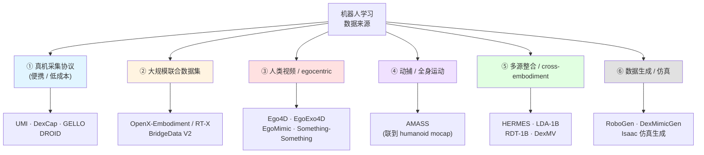

# 🧭 机器人学习的数据来源（主题地图）

> [!info] 这是主题地图，不是论文笔记
> 把「机器人策略需要什么数据、从哪儿来、怎么跨形态用」这个主题的文章按子角度排好——**算法侧的姊妹图**，跟 [[强化学习后训练 主题地图]] 互补。
> **用法**：读完一篇 → 更新「状态」列 → 把文章名改成 `[[链接]]` 指向 `papers/` 笔记；想排期读的移进 [[paper-list]] 的 📖 Reading。
> 关联：[[paper-list]]（阅读队列）｜[[强化学习后训练 主题地图]]（算法侧；数据怎么被 RL 消费在那边）｜[[参考运动作为塑形先验]]（概念笔记）｜标签：`#data` `#cross-embodiment`

---

## 1. 这个主题在问什么

**机器人策略（VLA / IL / RL）需要什么数据、从哪儿来、怎么跨形态用？**

这个主题里反复出现的张力：

- **数据稀缺 vs 标注成本** —— 真机轨迹贵，但仿真和人类视频有分布偏移
- **跨 embodiment gap** —— 人手 ≠ 灵巧手；不同机械臂自由度/工作空间不同；retargeting 怎么稳？
- **质量 vs 数量** —— 大规模异源数据 vs 少量精挑细选的高质量轨迹（[[LDA-1B]] 的"按质量分配角色"）
- **数据怎么被消费** —— 直接 IL 预训练？作为 RL 先验？作为 reward proxy？作为评测 benchmark？

> [!note] 邻域参照
> "数据怎么被 RL 消费"已经在 [[强化学习后训练 主题地图]] 内化（如 §3.4 想象空间 RL 用世界模型生数据、§3.5 HIL 真机数据）。**本图不重复**，只关心**数据本身**：从哪儿来、怎么采、怎么跨形态对齐。

> [!note] 为什么这是我的关注点
> RL 算法再好，没数据也跑不动。我的工程落地方向（[[RL 与模型后训练]]）跟数据采集 / 跨形态适配的关系很深——尤其灵巧手和移动操作，公开数据稀缺，UMI / DexCap / HERMES 这类便携采集 + 跨形态学习是绕不开的。

---

## 2. 子角度分类图

> 这张图刚开建，§3 表格里大部分行只填了名字 + "_待补_"——读到一篇就补一行。

---

## 3. 关键文章

> 「相关度」：核心 / 相关 / 边缘。「状态」：✅已读 / 📥队列中（在 paper-list）/ ⬜未读。
> 读完一篇后：更新状态 + 文章名改 `[[wiki-link]]`。

### 3.1 ① 真机采集协议（便携 / 低成本）

> 这一节关心"怎么用低成本设备采到大量高质量轨迹"，是后面所有 IL / RL 的基础。UMI 是这条路线的标志性工作（人手持夹爪，绕开机器人遥操作）。

| 文章 | 一句话作用 | 相关度 | 状态 | arXiv |
| :--- | :--- | :--- | :--- | :--- |
| **UMI** (Universal Manipulation Interface) | 手持夹爪 + 鱼眼相机的便携采集器，人手在野外直接采"机器人视角"数据，绕开遥操作 | 核心 | ⬜未读 | _待补_ |
| **DexCap** | 灵巧手版的便携采集——mocap glove + 视觉，专门解决灵巧手数据稀缺 | 核心 | ⬜未读 | _待补_ |
| **GELLO** | leader-follower 低成本遥操作硬件 | 相关 | ⬜未读 | _待补_ |
| **DROID** | 大规模真机操作数据集，多机构联合采集 | 相关 | ⬜未读 | _待补_ |

### 3.2 ② 大规模联合数据集

| 文章 | 一句话作用 | 相关度 | 状态 | arXiv |
| :--- | :--- | :--- | :--- | :--- |
| **OpenX-Embodiment / RT-X** | 21 机构联合的跨形态机器人操作数据，VLA 预训练的事实标准 | 核心 | ⬜未读 | _待补_ |
| **BridgeData V2** | 多任务桌面操作大数据集，VLA 评测常用 | 相关 | ⬜未读 | _待补_ |

### 3.3 ③ 人类视频 / egocentric

> 跟 §3.1 的区别：§3.1 是"用便携设备模拟机器人视角"，§3.3 是"直接拿现有海量人类视频/第一视角数据"。代价是 embodiment gap 更大。

| 文章 | 一句话作用 | 相关度 | 状态 | arXiv |
| :--- | :--- | :--- | :--- | :--- |
| **Ego4D / EgoExo4D** | Meta 大规模第一视角人类活动视频，机器人学习常用预训练源 | 相关 | ⬜未读 | _待补_ |
| **EgoMimic** | 用 egocentric 人类视频做模仿学习预训练 | 相关 | ⬜未读 | _待补_ |

### 3.4 ④ 动捕 / 全身运动

> 主要服务 humanoid / 全身控制；跟 [[参考运动作为塑形先验]] 概念笔记直接挂钩——AMASS 是 HIL × Multi-Task Reference RL 的数据源。

| 文章 | 一句话作用 | 相关度 | 状态 | arXiv |
| :--- | :--- | :--- | :--- | :--- |
| **AMASS** | 统一动捕格式的大规模人类全身运动库（SMPL 参数化） | 相关 · 背景 | ⬜未读 | _待补_ |

### 3.5 ⑤ 多源整合 / cross-embodiment 适配

> 这一节是本图的核心张力所在——**怎么把人手 / 多机型 / 仿真 / 真机多来源的数据，统一喂给一个策略**。HERMES 是触发本图的那篇。

| 文章 | 一句话作用 | 相关度 | 状态 | arXiv |
| :--- | :--- | :--- | :--- | :--- |
| **HERMES** | 多源人类手部动作数据 + RL + 端到端深度图像 sim2real，统一训移动双臂灵巧手；本图触发篇 | 核心 | 📥队列中 | [2508.20085](https://arxiv.org/abs/2508.20085) |
| **LDA-1B** | 异质 embodied 数据**按质量分配角色**（不丢低质轨迹）；latent dynamics + policy + visual forecasting 在结构化隐空间联合训练 | 核心 | 📥队列中 | [2602.12215](https://arxiv.org/abs/2602.12215) |
| **RDT-1B** | 大规模异源数据训练的 diffusion VLA（双臂、跨多形态机器人） | 核心 | ⬜未读 | _待补_ |
| **DexMV** | 灵巧手版的 human-to-robot：人类视频 → 灵巧手策略 | 相关 | ⬜未读 | _待补_ |

### 3.6 ⑥ 数据生成 / 仿真

> 用大模型 / 仿真器**生成**数据，绕开真机采集成本。

| 文章 | 一句话作用 | 相关度 | 状态 | arXiv |
| :--- | :--- | :--- | :--- | :--- |
| **RoboGen** | LLM 自动生成任务 + 场景 + 演示，无人工标注的 scalable robot learning | 相关 | ⬜未读 | _待补_ |
| **DexMimicGen** | 灵巧手任务的演示数据**自动扩增**——少量真人示范 → 海量仿真演示 | 相关 | ⬜未读 | _待补_ |

---

## 4. 跟我的关系

数据是 RL 后训练的另一只脚。**这张图的功能**是：当我读 [[强化学习后训练 主题地图]] 那批 paper、问"它的数据从哪儿来"时，能回到这里查范式。

两个关注点：

**① 跨 embodiment 的耦合度。** 数据形态决定能服务什么策略：
- §3.1（UMI / DexCap）→ 直接给机械臂 / 灵巧手做 IL，gap 最小
- §3.3（Ego4D）→ gap 最大，通常做表示学习 / pretrain，不直接做 policy
- §3.5（HERMES / LDA-1B）→ **跨这道 gap 的关键技术**，是我最该深读的一节

**② 数据 × 算法的乘法效应。** 同一篇文章可能既在本图 §3.5（数据角度）也在 RL 后训练图 §3.x（算法角度）——例如 HERMES 用 RL 但卖点是数据范式。**每篇只在主归属节列**，其他处只提名字、不重复表格。

> [!question] 我自己的工程切入点？（读到 4–5 篇后回来填）
> 提示方向：① 我的项目里数据从哪儿来？是不是该建本地的便携采集 / cross-embodiment retargeting pipeline？② [[LDA-1B]] 的"按质量分配角色"能不能直接用在我现在的项目上？③ HERMES 的 sim2real 路线对我移动灵巧手场景有多大借鉴？
> _现在别急着下结论，先把 §3.5 的 4 篇读完。_

---

## 5. 待补 / 存疑

- [ ] §3.1–§3.4、§3.6 的 arXiv 号都待核实——只列了名字 + "_待补_"，挑读到一篇就补一行
- [ ] §3.3 "Something-Something" 是否纳入存疑：它更像 video understanding 数据集而非机器人学习数据，可能该划出去
- [ ] §3.4 是否扩展更多 humanoid mocap 数据集——目前只列 AMASS，因为本图侧重 manipulation；如果未来 humanoid 方向论文多了，可单独抽一张图
- [ ] **可抽 / 已有的概念笔记**：
  - [[参考运动作为塑形先验]] —— 已有，跟 §3.4 + §3.5 都挂钩
  - 候选新概念：「便携式真机数据采集」「跨 embodiment retargeting」 —— 读到第 2 个实例就建

---

## Backlinks
（Obsidian 自动维护）
