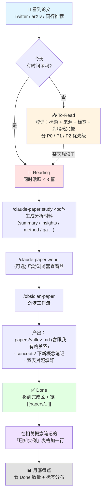

# 📚 Paper List（阅读队列）

> **使用习惯**：
> - 看到一篇有意思的 paper，**先扔到 📥 To-Read**，写一句"为啥感兴趣"和标签
> - 真正开始读时，移到 📖 Reading
> - 读完（含写完 obsidian 笔记）后，移到 ✅ Done，并链到 `papers/<title>.md`
>
> **不要**为 To-Read 里的每篇都立刻建 `papers/<title>.md`——等真开始读时再说。

---

## 🗺️ 工作流流程图

> 💡 这个图也是 `obsidian-paper` skill 的执行路径——下次跑 skill 时，模型会按这条流走。

---

## 📥 To-Read（待读）

### P0 必读（跟我方向直接相关，下个月内读）

| 标题 | 来源 | 标签 | 为啥感兴趣 | 加入日期 |
| :--- | :--- | :--- | :--- | :--- |
| Learning while Deploying: Fleet-Scale RL for Generalist Robot Policies (LWD) | [agibot finch](https://finch.agibot.com/research/lwd) | #RL #post-training #VLA #manipulation #bimanual #empirical #core | 跟 [[RISE  Self-Improving Robot Policy with Compositional World Model\|RISE]] 同一问题（VLA 后训练做 RL），但**路线相反**：RISE 在想象空间避开真机，LWD 直接用 16 台机器人舰队的真机部署数据做 offline-to-online RL（DIVL 值学习 + QAM 策略抽取）。RISE 的对照组，必比较。 | 2026-05-16 |
| Reinforcement Learning with Action Chunking (Q-chunking) | [arXiv 2507.07969](https://arxiv.org/abs/2507.07969) | #RL #manipulation #empirical #core | 把 action chunking 引入 TD-RL，解决长程稀疏奖励的探索 + n-step backup 稳定性。RISE/LWD 的策略都是 chunk 输出——这是「chunk × RL」这条线的**源头**（Qiyang Li / Sergey Levine 组）。 | 2026-05-16 |
| Q-learning with Adjoint Matching (QAM) | [arXiv 2601.14234](https://arxiv.org/abs/2601.14234) | #RL #diffusion-policy #empirical #core | **LWD 做 policy extraction 用的就是这个方法**——把 critic 梯度经 adjoint matching 转成 flow 策略的逐步监督，绕开对多步去噪反传的数值不稳。解决「怎么用 Q-function 训 diffusion/flow 策略」，RISE/LWD 都绕不开。读 LWD 的前置。 | 2026-05-16 |
| LDA-1B: Scaling Latent Dynamics Action Model via Universal Embodied Data Ingestion | [arXiv 2602.12215](https://arxiv.org/abs/2602.12215) | #world-model #data-quality #manipulation #dexterous-hand #empirical #core | 聚焦异质 embodied 数据的**质量问题**：不丢弃低质量轨迹，而是「给不同质量的数据分配不同角色」。跟 RISE/RECAP 的三类数据（expert/correction/rollout 区别对待）是同一主题——读时可能抽出一个「按数据质量分配角色」的概念笔记。latent dynamics + policy + visual forecasting 在结构化隐空间联合训练，含灵巧手 / 接触丰富任务。 | 2026-05-16 |
| RL Token: Bootstrapping Online RL with Vision-Language-Action Models | [arXiv 2604.23073](https://arxiv.org/abs/2604.23073) | #RL #post-training #VLA #manipulation #empirical #core | 又一个「VLA 后训练做 online RL」的方案，跟 RISE / LWD 同问题、不同解：RL Token 走**极简路线**——加一个紧凑的「RL token」读出表示 + 小 actor-critic head，既保留预训练知识又给 RL 一个接口，真机几分钟到几小时精炼动作。相对 RISE（想象空间）/ LWD（舰队真机），它是「最小侵入式」改造。Sergey Levine 组。 | 2026-05-16 |
| DiT4DiT: Jointly Modeling Video Dynamics and Actions for Generalizable Robot Control | [arXiv 2506.17518](https://arxiv.org/abs/2506.17518) | #world-model #VLA #manipulation #empirical #core | **Joint Diffusion WAM**（[[世界模型 主题地图]] §5.2b）这条线很有影响力的工作——跟 UWM / Cosmos Policy / [[LDA-1B]] / UVA / DreamZero 同簇。跟我已读的 [[RISE  Self-Improving Robot Policy with Compositional World Model\|RISE]] 是**结构性对照**：RISE 把 WM 当外部工具（cascaded 思想，[[Compositional World Model]]），DiT4DiT 把 WM 整合进策略架构本身（joint）——回答的是同一问题的两种范式。 | 2026-05-29 |

### P1 想读（相关但不急，3 个月内读）

| 标题 | 来源 | 标签 | 为啥感兴趣 | 加入日期 |
| :--- | :--- | :--- | :--- | :--- |
| Decoupled Q-Chunking | [arXiv 2512.10926](https://arxiv.org/abs/2512.10926) | #RL #empirical #related | Q-chunking 的改进：critic 的 chunk 长度与 policy 解耦——策略可更短更 reactive，同时靠 optimistic distilled critic 保留多步 value 传播。读完 Q-chunking 再看。 | 2026-05-16 |
| DyWA: Dynamics-adaptive World Action Model for Generalizable Non-prehensile Manipulation | [arXiv 2503.16806](https://arxiv.org/abs/2503.16806) | #world-model #manipulation #empirical #related | 跟 LDA-1B 同一作者（Jiangran Lyu），是「World/Latent Dynamics + Action Model」这条线较早的一篇，LDA-1B 像它的 scaling 版。核心 dynamics-adaptive：靠历史轨迹推断物体质量/摩擦等动力学变化并自适应，做非抓取式操作（推/滑），无需多视角相机或精确位姿。读它能看清 LDA-1B 的方法谱系。 | 2026-05-16 |
| A Survey of State Representation Learning for Deep Reinforcement Learning | [arXiv 2603.10448](https://arxiv.org/abs/2603.10448) | #survey #RL #representation-learning #related | 综述里把 **state representation 放在比 reward 更核心**的位置——这个 state-centric 视角很合我胃口，是审视 [[RL 与模型后训练]] 时一个有力的反向锚点。SRL 是 [[Compositional World Model]] / JEPA / RSSM / contrastive / bisimulation 等的共同上位词；当**字典型参考**用，写 related work 时回头查 + cite。 | 2026-05-29 |

### P2 有空看看（边缘相关，看心情）

| 标题 | 来源 | 标签 | 为啥感兴趣 | 加入日期 |
| :--- | :--- | :--- | :--- | :--- |
|  |  |  |  |  |

---

## 📖 Reading（正在读）

> ⚠️ 同时在读的别超过 3 篇——多了任何一篇都读不深。

| 标题 | 起始日期 | 进度 | 笔记 |
| :--- | :--- | :--- | :--- |
| World Action Models: The Next Frontier in Embodied AI（综述） | 2026-05-17 | 在读（PDF: `pdfs/World Action Models Survey.pdf`） | 笔记待建 |

---

## ✅ Done（读完了）

| 标题 | 主题标签 | 完成日期 | 笔记链接 |
| :--- | :--- | :--- | :--- |
| RISE: Self-Improving Robot Policy with Compositional World Model | #world-model #VLA #model-based-rl #core | 2026-05-15 | [[RISE  Self-Improving Robot Policy with Compositional World Model]] |

---

## 📝 标签词典

> 维护一个统一的标签库，避免 `#WorldModel`、`#world_model`、`#世界模型` 散乱。每次加新标签就来这里登记一下。

### 主题（papers 是关于什么的）
- `#world-model` —— 世界模型 / dynamics 学习
- `#VLA` —— Vision-Language-Action 模型
- `#RL` —— 强化学习（通用）
- `#post-training` —— 基础模型后训练
- `#model-based-rl` —— Model-based RL
- `#diffusion-policy` —— 扩散策略
- `#imitation-learning` —— 模仿学习
- `#advantage-conditioned` —— Advantage-conditioned 训练范式
- `#data-quality` —— 数据质量 / 异质数据处理 / 按质量分配角色
- `#inference-dynamics` —— 推理动力学：策略如何表示 / 生成 / 实时执行动作
- `#representation-learning` —— 表示学习 / state representation（RSSM / JEPA / contrastive / bisimulation 的上位词）

### 应用场景
- `#manipulation` —— 机械臂抓取/操作
- `#dexterous-hand` —— 灵巧手 / 肌肉控制
- `#mobile-robot` —— 移动机器人
- `#bimanual` —— 双臂协作

### 与我方向的匹配度（**最重要的标签**——决定优先级）
- `#core` —— **核心相关**，必读必比较
- `#related` —— 相关但不直接竞品
- `#tangent` —— 边缘相关，了解即可

### 论文性质
- `#survey` —— 综述
- `#position` —— 立场/观点文章
- `#empirical` —— 实证研究
- `#theory` —— 理论
- `#benchmark` —— Benchmark / dataset

---

## 🔧 工作流提醒

**新看到一篇 paper（Twitter / arXiv / 同行推荐）**：
1. 复制标题进 📥 P0/P1/P2 之一
2. 写"为啥感兴趣"——一句话就行，**今天的你**最知道为啥它有意思
3. 加标签

**今天想读哪篇了**：
1. 从 📥 移到 📖 Reading
2. 把论文 PDF 下载到 `pdfs/` 文件夹——**所有 PDF 统一放这里**，别散落各处
3. （可选）跑 `/claude-paper:study "pdfs/<paper>.pdf"` 生成分析材料
4. 跑 `/obsidian-paper` 进入沉淀流程

**读完了**：
1. 从 📖 移到 ✅ Done
2. 把笔记链接 `[[...]]` 加上
3. 在 [[Compositional World Model]] / 其他相关概念笔记的"已知实例"表里加一行

---

## 📊 统计（手动维护，月底盘点用）

- To-Read 总数：9（P0：LWD / Q-chunking / QAM / LDA-1B / RL-Token / DiT4DiT；P1：Decoupled Q-Chunking / DyWA / SRL Survey）
- Reading：1（World Action Models 综述，2026-05-17 起）
- Done：1
- **本月新读完**：1
